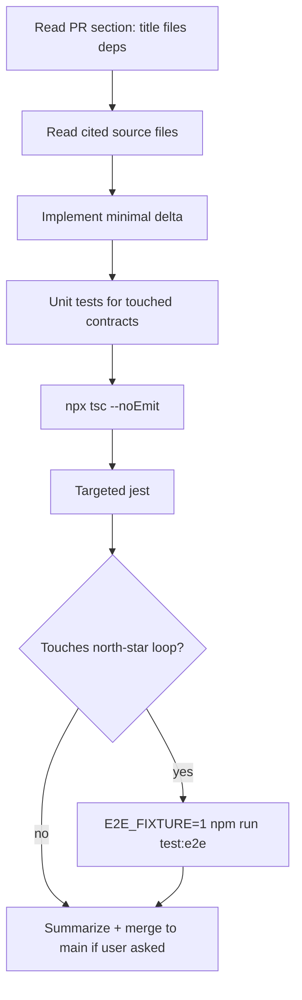

# BioIntel Agentic CLI & Agent Workflow — Design Specification

**Product:** BioIntel Discovery Workbench  
**Audience:** Coding agents, CLI-driven automation, and human implementers operating the repo  
**Date:** 2026-07-16  
**Status:** Implementable design — **Draft / Rev 1.1** (review fixes)  
**Parent product design:** `docs/design/discovery-workbench-v2.1.md` (draft package: co-located product design temp file)  
**Canonical project copy (when promoted):** `docs/design/agentic-workflow-cli.md`  
**Repo root:** `C:\Users\kevin\workspace\kBioIntelBrowser04052026`  
**Constraint law (binding — agents must never violate):** Free public APIs only; evidence-first; no regulatory decision support; solo + file export default; deterministic ranking without LLM; **AI only claim-bound on packs/hypotheses**

---

## 0. Purpose

This document specifies **how coding agents and CLI automation must operate** against BioIntel:

1. What product laws they may never break  
2. Where truth lives in the repo (canonical paths)  
3. Exact command cookbook (Windows PowerShell primary; bash where both matter)  
4. Free API surfaces safe for automation  
5. Workflow playbooks (PR implementation, M1 verify, product events, pack claims)  
6. Proposed root `AGENTS.md` content  
7. Explicit forbidden actions  

It is the companion to **Discovery Workbench v2.1** (hardening phase). Product behavior changes are owned by the v2.1 design; this doc owns **agent process and safety**.

---

## 1. Product law constraints (agents must never violate)

These are **hard stops**. If a task conflicts with product law, agents must refuse the violating part and implement the legal subset — or stop and report the conflict.

| Law | Meaning for agents | Common violation to avoid |
|---|---|---|
| **Free public APIs only** | Only integrate/call free public sources already in-repo or clearly free (Orphadata, OT, ChEMBL, PubChem, openFDA, CT.gov, etc.) | Adding DrugBank, Cortellis, paid keys, scraping ToS-hostile paid portals |
| **Evidence-first** | Claims need provenance (`source` + `retrievedAt` where required); no invented literature | Fake claim rows to pass M3 |
| **No regulatory decision support** | UI/docs/copy must not claim approval, labeling, or “safe for patients” decisions | “FDA-ready”, “will be approved”, clinical advice |
| **Solo + file export default** | LocalStorage/IDB/file download first; share optional | Requiring multi-tenant cloud DB / auth for core loop |
| **Deterministic ranking without LLM** | Rank path is pure code (`engine`, `scoreAxes`, harvest); no model rewrites scores | “Improve rank with GPT”, free-form Discover Why AI |
| **AI only claim-bound on packs/hypotheses** | Pack AI / RH next experiments only; allowlist claims | Reintroducing `WhyRationalePanel` / free-form shortlist narratives |
| **No dual-emit reintroduction** | Product events are **canonical names only** after v2 clean-cut | Rebuilding `PRODUCT_EVENT_ALIASES` fan-out without design |
| **Extractor pack lock** | Board packs use **5** extractor panels only | Full 15-panel Core fetch “for density” |
| **ResearchHypothesis ≠ set-ops Hypothesis** | `/projects/.../hypothesis` vs `/hypothesis` | Unifying types “for cleanup” |

### 1.1 Severity rubric for agent mistakes

| Severity | Examples | Required response |
|---|---|---|
| **Blocker** | Paid API, LLM ranking, regulatory claims, dual-emit without design, exploits | Do not implement; revert if already written |
| **High** | Break subject attribution on pack claims; drop InChIKey on save; auto-harvest on watching | Fix before merge |
| **Med** | Missing product event props; flaky e2e without fixture mode | Fix in same PR when touching area |
| **Low** | Copy polish, testid additions | OK in polish PRs |

---

## 2. Canonical paths (truth map)

Agents should read these before changing related behavior.

### 2.1 Design docs

| Doc | Path |
|---|---|
| Workbench v1 | `docs/design/discovery-workbench-v1.md` |
| Workbench v2 (shipped) | `docs/design/discovery-workbench-v2.md` |
| Workbench v2.1 (hardening) | `docs/design/discovery-workbench-v2.1.md` |
| This agent CLI spec | `docs/design/agentic-workflow-cli.md` |
| Historical plans (non-binding) | `docs/plans/*` |
| Memory (user prefs) | `memory/MEMORY.md`, `memory/feedback_*.md` |

### 2.2 Discover (rank loop)

| Concern | Path |
|---|---|
| Discover page | `src/app/discover/page.tsx` |
| Hook / rank client | `src/app/discover/hooks/useDiscovery.ts` |
| Engine | `src/lib/discovery/engine.ts` |
| Score axes | `src/lib/discovery/scoreAxes.ts` |
| Preferences | `src/lib/discovery/preferences.ts` |
| URL sync | `src/lib/discovery/discoverUrl.ts` |
| Tour examples | `src/lib/discovery/tourExamples.ts` |
| Harvest API client usage | `src/lib/discovery/harvest.ts` + `src/lib/project/boardHarvest.ts` |
| Rank API | `src/app/api/discover/rank/route.ts` |
| Harvest API | `src/app/api/discover/harvest/route.ts` |

### 2.3 Project board / pack / RH

| Concern | Path |
|---|---|
| Project store | `src/lib/project/store.ts` |
| Board harvest | `src/lib/project/boardHarvest.ts` |
| Pack claims (5 extractors) | `src/lib/project/packClaims.ts` |
| Pack IDB cache | `src/lib/project/packCache.ts` |
| RH rehydrate | `src/lib/project/rehydrateClaims.ts` |
| Research hypothesis store | `src/lib/project/researchHypothesis.ts` |
| Export/import | `src/lib/project/exportImport.ts` |
| PackBuilder UI | `src/components/evidence/PackBuilder.tsx` |
| Pack AI UI | `src/components/evidence/PackAiPanel.tsx` (**present on main**) |
| Project board page | `src/app/projects/[id]/page.tsx` |
| RH editor page | `src/app/projects/[id]/hypothesis/[hid]/page.tsx` |
| Claim extractors SSOT | `src/lib/evidence/extractAll.ts` |
| Evidence pack builder | `src/lib/evidence/pack.ts` |

### 2.4 Product events / analytics

| Concern | Path |
|---|---|
| Event names + emit | `src/lib/productEvents.ts` |
| Funnel UI | `src/components/analytics/ProductFunnelPanel.tsx` |
| Analytics POST | `src/app/api/analytics/route.ts` |
| Analytics summary | `src/app/api/analytics/summary/route.ts` |
| v2.1 funnel helpers (planned) | `src/lib/analytics/m1Funnel.ts` |

### 2.5 Tests

| Concern | Path |
|---|---|
| Jest unit/integration | `__tests__/**` |
| Discovery project tests | `__tests__/lib/project/*`, `__tests__/lib/discovery/*` |
| E2E Playwright | `e2e/*.spec.ts` |
| Jest config | `jest.config.ts` (ignores `e2e/`) |
| Playwright config | `playwright.config.ts` |

---

## 3. Recommended agent CLI cookbook

**Shell note:** User environment is **Windows + PowerShell**. Prefer PowerShell snippets. Bash provided where agents run in Git Bash/WSL/CI Linux.

**Chaining:** In the agent PowerShell tool environment, `&&` may be unsupported — use `;` or separate commands. In standard PowerShell 7+ / bash, `&&` is fine.

### 3.1 Lifecycle

| Intent | PowerShell | bash |
|---|---|---|
| Dev server | `npm run dev` | `npm run dev` |
| Production build | `npm run build` | `npm run build` |
| Start prod server | `npm start` | `npm start` |
| Lint | `npm run lint` | `npm run lint` |
| Typecheck | `npx tsc --noEmit` | `npx tsc --noEmit` |

### 3.2 Tests

| Intent | Command |
|---|---|
| All jest | `npm test` |
| Watch | `npm run test:watch` |
| Coverage | `npm run test:coverage` |
| Playwright e2e (fixture/CI default after V21-02) | `$env:E2E_FIXTURE=1; npm run test:e2e` (bash: `E2E_FIXTURE=1 npm run test:e2e`) |
| Playwright e2e live (optional) | `npm run test:e2e:live` when scripted, or run without fixture stubs |
| Live API smoke (if used) | `npm run test:live` |
| Pre-merge gate (when scripted) | `npm run test:gate` |

#### 3.2.1 Jest targeting patterns (repo-realistic)

Jest is configured with `next/jest`; tests live under `__tests__/`. Prefer path patterns:

```powershell
# Product events + funnel
npm test -- --testPathPattern="productEvents"

# Pack / RH / board
npm test -- --testPathPattern="packClaims|rehydrateClaims|packCache|boardHarvest"

# Discovery scoring / prefs
npm test -- --testPathPattern="scoreAxes|preferences|useDiscovery|candidateRanker"

# Domain merge / identity
npm test -- --testPathPattern="mergeCandidate|identity|score\.test"

# Single file
npm test -- __tests__/lib/project/packClaims.test.ts

# Name filter inside files
npm test -- --testPathPattern="packClaims" --testNamePattern="subjectCandidateId"
```

bash equivalents are identical (`npm test -- --testPathPattern=...`).

#### 3.2.2 Recommended pre-merge gate (v2.1)

PowerShell (agent harness — separate commands; avoid relying on `&&`):

```powershell
npx tsc --noEmit
npm test -- --testPathPattern="productEvents|packClaims|rehydrateClaims|boardHarvest|scoreAxes|packCache|m1Funnel|mergeCandidate" --passWithNoTests
```

`package.json` script form (npm’s shell — `&&` is fine here):

```json
"test:gate": "npx tsc --noEmit && npm test -- --testPathPattern=\"productEvents|packClaims|rehydrateClaims|boardHarvest|m1Funnel|scoreAxes|mergeCandidate|packCache\" --passWithNoTests"
```

**Always use `npx tsc --noEmit`** (there is no `tsc` npm script).

North-star e2e (after V21-02) — **fixture default**; requires running app unless `webServer` is added to `playwright.config.ts` (today: **no webServer** — run `npm run dev` first, default port **33424** / `PLAYWRIGHT_BASE_URL`):

```powershell
npm run dev   # separate terminal
$env:E2E_FIXTURE = "1"
npm run test:e2e
```

**Do not** require the entire `__tests__/api/**` suite on every small PR unless the PR touches those routes.

### 3.3 Git preferences (agents)

| Rule | Detail |
|---|---|
| **Main-first** | When the user asks for main-only / no branch sprawl: commit and work on `main` (or the branch user names). Do **not** invent feature-branch process theater. |
| **User override** | If user requests a branch/PR workflow, follow user. |
| **Commits** | Small, reviewable; message matches PR-V21 titles when implementing the plan. |
| **No force-push** to shared main unless user explicitly orders it. |
| **Secrets** | Never commit `.env` with keys; this product should not need paid API keys. |

```powershell
git status
git diff
git log -5 --oneline
# stage & commit only when user workflow expects it
```

### 3.4 Useful file discovery

Prefer the agent harness **`grep` / `rg` tools** (not PowerShell brace globs — `src\**\*.{ts,tsx}` is unreliable on Windows PowerShell 5.x).

```powershell
# If rg is on PATH:
rg "emitProductEvent\(" src
rg "pack_exported" src/components/evidence
```

---

## 4. API surfaces agents may call for automation

**Document only free endpoints already in the app.** Agents must not invent paid gateways.

### 4.1 Discover rank

```http
POST /api/discover/rank
Content-Type: application/json
```

Typical body fields (see route + `useDiscovery` for current schema): disease query / diseaseId, pinned targets (max 10), rubric prefs, harvest flags for rank-time vs deferred.

**Agent rules:**

- Treat response dual schema: legacy candidates + `v2` domain candidates  
- Do not post-process scores with an LLM  
- Use for fixture capture / smoke, not for scraping at abusive rates  

### 4.2 Discover harvest

```http
POST /api/discover/harvest
Content-Type: application/json
```

Body shape (v2 design / `boardHarvest`):

```ts
{
  candidates: Array<{
    name: string
    candidateId?: string
    scores?: ScoreVector
    phaseNorm?: number | null
    clinicalStage?: number | null
  }>  // 1–15
  runSafety?: boolean
  runNovelty?: boolean
  rubricPreset?: string
  aeAggressiveness?: string
}
```

**Agent rules:** Max 15 candidates; name-only OK; used on **promote** / explicit CTA — do not design auto-harvest on watching.

### 4.3 Orphanet genes

```http
GET /api/orphanet/genes?q=ATTR+amyloidosis
GET /api/orphanet/genes?orphaCode=12345
```

**Response shapes (verified route):**

| Case | Body |
|---|---|
| `?q=` hit | `{ orphaCode, diseaseName, genes }` |
| `?orphaCode=` | `{ orphaCode, genes }` |
| Soft fail | HTTP **200** `{ genes: [], error: string }` |
| No hit | `{ genes: [], orphaCode: null }` |

**Agent rules:** Free Orphadata only; **parse full body** into provenance (`orphaCode`, `diseaseName`, `genes`, `error?`) — do not only use `genes`. Optional re-rank is **user-triggered** (never auto-loop rank↔orphanet).

### 4.4 Analytics / product events

```http
POST /api/analytics
Content-Type: application/json
```

Product events from the browser are shaped by `emitProductEvent` →:

```ts
{
  source: 'product',
  endpoint: ProductEventName, // e.g. discover_rank_completed
  status: 200,
  duration_ms: number,
  items_count: number,
  error?: string // optional props JSON slice ≤500
}
```

Canonical names (do not invent aliases): see `ProductEventName` in `src/lib/productEvents.ts`.

Examples: `discover_started`, `discover_disease_confirmed`, `discover_rank_completed`, `discover_stage`, `board_candidate_added`, `board_status_changed`, `pack_exported`, `pack_opened`, `research_hypothesis_opened`, `harvest_safety_done`, `discover_orphanet_genes`, `rubric_changed`, `preference_tooltip_opened`, `ai_response`, …

**Agent rules when adding events:**

1. Add to `ProductEventName` union + `PRODUCT_EVENT_LABELS` + `PRODUCT_EVENT_METRIC`  
2. Emit via `emitProductEvent` only (no dual-emit)  
3. Map to M1–M9 correctly  
4. Never put secrets, full project JSON dumps, or PHI in props  
5. Unit-test label/metric maps  
6. **Pack telemetry props (verified on main):**  
   - `pack_exported`: `{ format, count, citable }` today — V21-01 adds `claimCount`/`citableCount` dual keys; **m1Funnel dual-reads both**  
   - `pack_opened`: `{ projectId, claimCount, citable }` — add `citableCount` alias  
   - `discover_rank_completed`: today no `ms` — V21-01 **must** emit `ms: timingMs.total` for M7  
7. **M7 math:** use only `discover_rank_completed.ms` (cheap); **never** average `harvest_safety_done` into shortlist P50/P95 even though `PRODUCT_EVENT_METRIC` maps harvest → M7 historically  

### 4.5 Pack export & IDB cache (client-side)

Pack export is **not** a server download API — `PackBuilder` builds an `EvidencePack` client-side and triggers file download.

| Piece | Contract |
|---|---|
| Build claims | `buildBoardPackClaims` in `packClaims.ts` |
| Max candidates | 5 (`PACK_MAX_CANDIDATES`) |
| Panels | 5 extractor-backed only |
| IDB name | `biointel-packs` |
| Store | `packs` |
| LRU | 20 (`PACK_IDB_LRU_MAX`) |
| API | `putPackInCache(pack)`, `getPackFromCache(id)` |
| Rehydrate | `rehydrateClaimsForHypothesis` → IDB then rebuild |
| Download→IDB | **Already shipped** via `registerSideEffects` on download **and** share |

**Agent rules:** Always preserve `subjectCandidateId` when multi-CID; never merge panels across molecules then re-extract; **do not re-plumb** IDB-on-download (verify only). Share work = failure UX + tests.

### 4.6 Optional share

```http
POST /api/snapshot
```

Used when collaboration prefs enable share links. Download must work if snapshot fails; UI must not flash success on non-OK.

### 4.7 Pack AI (claim-bound only)

```http
POST /api/ai/pack
```

Gate with `minClaimsForPackMode(mode)` from `src/lib/ai/contracts.ts`. Modes include gap analysis, executive brief, next experiment, red team — refuse when under min claims.

**Agent rules:** Do not add free-form Discover ranking AI “for consistency.”

---

## 5. Workflow playbooks

### 5.1 Implement a PR from the design PR Plan

**Input:** A `PR-V21-0X` section from `discovery-workbench-v2.1.md`.



**Checklist:**

1. Confirm deps of the PR are already on main (or implement soft-deps carefully).  
2. Do not expand scope into later PRs.  
3. Match existing code style; no drive-by refactors.  
4. Update emit props if the PR touches pack/rank (dual pack keys; rank `ms`).  
5. If behavior changes product law surface, stop — update design first.  
6. Prefer main when user requested main-only.

### 5.2 Verify M1 loop manually / e2e

**Manual (repurposing default):**

1. `npm run dev`  
2. Open `/discover` — disease e.g. Type 2 diabetes or NSCLC  
3. Confirm disease if multi-hit  
4. Pin 1–3 targets if needed; rank  
5. Save ≥1 candidate to project  
6. Open project → **Promote** → wait harvest  
7. Build pack → download → note claim/citable counts / warnings  
8. Seed/open Research Hypothesis → confirm statements rehydrate  
9. Open `/analytics` → confirm funnel events / export (v2.1); M7 uses rank `ms` only  

**Manual (rare persona):**

1. Enable rare-only tour + Orphanet boost (or persona preset)  
2. ATTR or CF path  
3. Confirm Orphanet provenance UI shows **ORPHA code** from full API body (v2.1)  
4. Optional re-rank CTA only when user would click  

**Automated:**

```powershell
# Start app first (playwright.config has no webServer today)
npm run dev
# Fixture default for CI/gate (after V21-02):
$env:E2E_FIXTURE = "1"
npm run test:e2e
# Live optional: omit fixture stubs / use test:e2e:live when scripted
```

**Success signals:** M1 temporal join / events present; M3 citable ≥5 on happy path (**read `citable` or `citableCount`**) or explicit density warning; RH shows text not bare ids; rank events eventually carry `ms` for M7.

### 5.3 Add a product event safely

1. Read `src/lib/productEvents.ts`  
2. Add name to `ProductEventName`  
3. Add `PRODUCT_EVENT_LABELS` human string  
4. Add `PRODUCT_EVENT_METRIC` → `M1`…`M9` or `'—'`  
5. Call `emitProductEvent('your_event', { ...props })` at the UX site  
6. **Do not** add to `PRODUCT_EVENT_ALIASES` (must stay empty / unused) — dual-read of **prop keys** is OK; dual-emit of **event names** is not  
7. Update `ProductFunnelPanel` / `m1Funnel` only if new aggregate is needed  
8. Test: map includes name; emit does not throw without `window`  

**Props hygiene:**

- Prefer scalars: `count`, `ms`, `status`, `stage`  
- Pack: keep historical `count`/`citable` and add `claimCount`/`citableCount` (V21-01)  
- Rank: include `ms` from `timingMs.total` on `discover_rank_completed`  
- Avoid large blobs  
- Optional `sessionId` only if implementing v2.1 session join  

### 5.4 Touch pack claims without breaking subject attribution

**Sacred algorithm** (`packClaims.ts`):

```
for each selected candidate with CID (max 5):
  panels_i = fetch extractor panels for THAT cid
  claims_i = extractClaimsFromCorePanels(panels_i, {
    subjectCandidateId: candidate.candidateId,
    moleculeName: candidate.identity.name,
    retrievedAt,
  })
allClaims = dedupeClaimsById(concat(claims_i)).slice(0, 200)
```

**`selectPackCandidates` semantics (v2.1 deliberate change):**

| Today (main) | v2.1 |
|---|---|
| **Exclusive tier:** if any promote-with-CID → **only** those (no fill from watching) | **Multi-partition fill:** sort each tier by richness; concat promote → watching → other; slice 5 |

This **will break** tests that assert `pick.every(c => boardStatus === 'promote')` when watching could fill remaining slots — update those tests in V21-03.

**Allowed:**

- Replace exclusive tier with multi-partition fill + richness proxy  
- Add warnings for empty panel keys  
- Adjust concurrency/timeouts within design budgets  
- Prefer promote CIDs **first**, then fill  

**Forbidden:**

- Merge all candidates’ panels into one bag then extract once  
- Drop `subjectCandidateId`  
- Fetch non-extractor panels “just in case” for board packs  
- Cap raise without design (200 claims / 5 candidates)  
- Post-build “replacement pass” extra CID fetches in V21-03 (out of scope)  

**Tests required when touching:**

```powershell
npm test -- --testPathPattern="packClaims"
```

Assert multi-CID claims keep distinct subjects; empty fixtures produce warnings; multi-partition fill case (1 promote + watching → length up to 5).

---

## 6. Proposed root `AGENTS.md`

Promote roughly the following content to repo root `AGENTS.md` (PR-V21-08). Keep it short enough that agents actually read it.

```markdown
# AGENTS.md — BioIntel Discovery Workbench

## Product law (non-negotiable)
- Free public APIs only (no paid DBs / keys as product requirements)
- Evidence-first; no regulatory decision support language
- Solo + file export default (localStorage / IDB / download); share optional
- Deterministic ranking; never put LLMs in the rank path
- AI only claim-bound on packs / research hypotheses (no free-form Discover Why AI)
- Canonical product events only — do not reintroduce dual-emit aliases
- Board packs: 5 extractor panels max; preserve claim subjectCandidateId

## Canonical docs
- docs/design/discovery-workbench-v1.md
- docs/design/discovery-workbench-v2.md
- docs/design/discovery-workbench-v2.1.md
- docs/design/agentic-workflow-cli.md

## Canonical code areas
- Discover: src/app/discover/**, src/lib/discovery/**
- Projects/packs/RH: src/lib/project/**, src/components/evidence/**
- Events: src/lib/productEvents.ts
- Extractors: src/lib/evidence/extractAll.ts

## Commands
- Dev: npm run dev  (required before e2e; playwright has no webServer by default)
- Typecheck: npx tsc --noEmit
- Unit: npm test
- Targeted: npm test -- --testPathPattern="packClaims|productEvents|boardHarvest|m1Funnel"
- Gate (when scripted): npm run test:gate  (= npx tsc --noEmit && key jest)
- E2E fixture (CI/gate): set E2E_FIXTURE=1 then npm run test:e2e
- E2E live (optional): npm run test:e2e:live when scripted
- Lint: npm run lint
- Build: npm run build

## Measurement contracts (v2.1)
- Pack props dual-read: count|claimCount and citable|citableCount
- M7: discover_rank_completed.ms only — exclude harvest_safety_done from P50/P95
- M1 completedLoops: temporal join (see discovery-workbench-v2.1 §5.1)
- selectPackCandidates: multi-partition fill (not exclusive promote-only tier)

## Git
- Prefer main when the user asked for main-only; no branch sprawl by default

## Do NOT
- Add paid APIs, biologics-first entity models, de novo gen chem, multi-tenant cloud DB requirements
- Reintroduce free-form Discover ranking AI
- Dual-emit legacy product event names without a design revision
- Full 15-panel fetch for board pack density
- Re-plumb download→IDB (already in PackBuilder.registerSideEffects)
- Write exploits, malware, or attack scripts
- Invent regulatory claims or “this drug works” predictions
- Ask the user coding trivia when feedback says make technical decisions yourself
```

---

## 7. What agents must NOT do

| Forbidden | Why |
|---|---|
| Write exploits, exploit PoCs, malware, or attack any system | Safety policy |
| Invent paid APIs or require commercial keys | Free-API law + user cannot afford paid |
| Free-form Discover Why AI / score invention narratives | Claim-bound AI law |
| Dual-emit reintroduction without design | Clean-cut already shipped |
| LLM ranking or rubric invention | Deterministic ranking |
| Full Core 15-panel board pack fetch | Latency + extractors ignore extras |
| Break multi-CID `subjectCandidateId` attribution | Scientific trust |
| Multi-tenant cloud project DB as silent default | Solo + export law |
| Regulatory / labeling decision language | Liability |
| Silent scope expansion past PR-V21 plan | Process + quality |
| Commit secrets | Security |
| Delete golden fixtures to make tests pass | Integrity |
| Fabricate M3 claims without provenance | Evidence-first |
| Auto re-rank after Orphanet merge without user CTA | v2.1 product decision |
| Unify ResearchHypothesis with set-ops `/hypothesis` | KD17 |

---

## 8. Metrics agents should care about (when validating)

| Metric | Agent check |
|---|---|
| **M1** | Temporal join `completedLoops` (not raw min of counters); panel includes `pack_exported` |
| **M3** | Dual-read citable ≥5 on happy-path pack **or** density warning shown |
| **M7** | `discover_rank_completed.ms` P50/P95; stages diagnostic only; **exclude harvest** |
| **M5** | Pack AI refuses under min claims |

Event SSOT: `src/lib/productEvents.ts`. Funnel SSOT: product design §5.

---

## 9. Mapping to v2.1 PR Plan (agent assignment guide)

| PR | Agent focus | Gate commands |
|---|---|---|
| V21-01 | `m1Funnel`, panel packOrRh+export, rank `ms`, dual pack props | `npx tsc --noEmit`; jest `m1Funnel\|productEvents` |
| V21-02 | Fixture north-star e2e; optional live | `E2E_FIXTURE=1 npm run test:e2e` (+ `npm run dev`) |
| V21-03 | Multi-partition fill + warnings; update exclusive-tier tests | jest `packClaims` |
| V21-04 | Full Orphanet body provenance + tour | jest useDiscovery/tour; manual rare path |
| V21-05 | discoverSessions localStorage (**no e2e dep**) | unit + manual restore |
| V21-06 | harvest/trust; share **failure** UX (IDB already on download) | mock snapshot 500; manual share fail |
| V21-07 | fixtures + `test:gate` (`npx tsc` in script) | `npm run test:gate` |
| V21-08 | `AGENTS.md` + design promotion | docs only |

---

## 10. Security, privacy, and observability for agents

- Prefer local verification; do not exfiltrate user project boards to third parties  
- `/api/analytics` is best-effort product telemetry — keep props small  
- When debugging packs, use downloaded JSON / IDB — never paste sensitive lab notes into external tools if user marks them private  
- Rate-limit live free API hammering in loops (harvest max 15; pack max 5 CIDs)  

---

## 11. Open questions

| Topic | Default for agents |
|---|---|
| Branch vs main | **Main** when user prefers; else user-specified |
| E2E in every PR | Only if PR touches north-star path; **fixture default** |
| Capturing live golden fixtures | Allowed if free APIs + sanitized; commit JSON fixtures not secrets |
| Adding new product events | Allowed if M-mapped and design-aligned; no dual-emit of **names** |
| Pack prop dual-keys | Emit both historical + design names; dual-read in m1Funnel |
| selectPackCandidates | Multi-partition fill (document test updates) |

---

## 12. Key Decisions (agent workflow)

| # | Decision | Rationale |
|---|---|---|
| **KD-AW-1** | Product law is hard-stop for agents | Prevents “helpful” law-breaking |
| **KD-AW-2** | Canonical paths listed in this doc + AGENTS.md | Reduce re-discovery |
| **KD-AW-3** | CLI cookbook PowerShell-first | Matches user OS |
| **KD-AW-4** | Free in-app endpoints only for automation docs | No invented paid APIs |
| **KD-AW-5** | Playbooks for PR / M1 / events / pack claims | Highest-risk workflows |
| **KD-AW-6** | Root AGENTS.md short + linked to full design | Agents actually read it |
| **KD-AW-7** | Explicit forbidden list including dual-emit & Why AI | Recurring failure modes |
| **KD-AW-8** | Main-first git when user asked | Avoid process theater |
| **KD-AW-9** | Subject attribution sacred on pack edits | Scientific correctness |
| **KD-AW-10** | Gate = `npx tsc --noEmit` + key jest; not full API tree | Practical CI |
| **KD-AW-11** | Fixture e2e is gate default; live optional; start dev (no webServer) | CI-realistic |
| **KD-AW-12** | Dual-read pack telemetry props; M7 excludes harvest | Match main instrumentation |
| **KD-AW-13** | Multi-partition pack select is intentional behavior change | Update exclusive-tier tests |

---

## 13. References

- Parent: `docs/design/discovery-workbench-v2.1.md`  
- Shipped loop: `docs/design/discovery-workbench-v2.md`  
- Events: `src/lib/productEvents.ts`  
- Pack: `src/lib/project/packClaims.ts`, `packCache.ts`, `rehydrateClaims.ts`  
- PackBuilder emits: `src/components/evidence/PackBuilder.tsx`  
- Pack AI: `src/components/evidence/PackAiPanel.tsx`  
- Scripts: `package.json`  
- E2E: `e2e/smoke.spec.ts`, `playwright.config.ts` (no webServer)  
- Orphanet: `src/app/api/orphanet/genes/route.ts`  
- Analytics: `src/app/api/analytics/route.ts`  

---

## Revision History

| Rev | Date | Notes |
|---|---|---|
| Draft Rev 1 | 2026-07-16 | Initial agentic CLI + workflow spec paired with v2.1 hardening design |
| Draft Rev 1.1 | 2026-07-16 | Review: pack prop dual-read; M7/rank ms; multi-partition select; fixture e2e; IDB already on download; Orphanet full body; gate script `npx tsc`; PackAiPanel present; no brace-glob Select-String |
