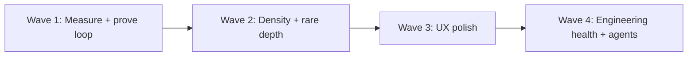
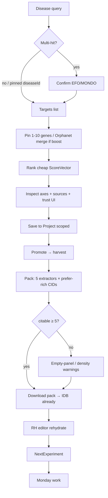
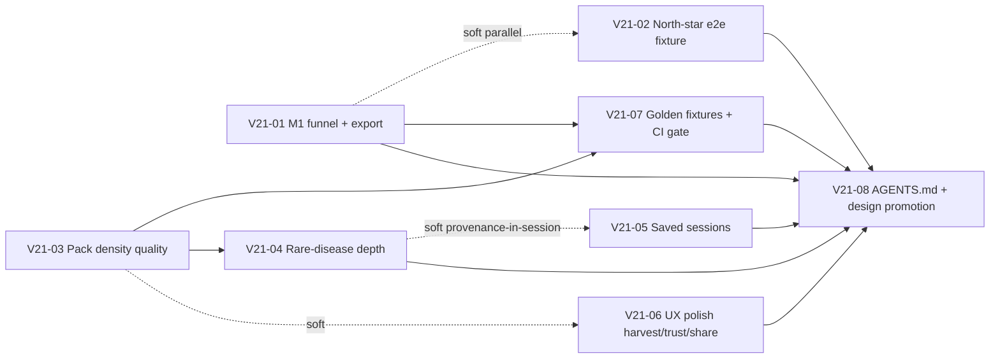

# BioIntel Discovery Workbench v2.1 — Design Document  
## Hardening phase (post-v2) + measurement, density, rare-disease depth, engineering health

**Product:** BioIntel Discovery Workbench (continuation of v2, main as of 2026-07-16)  
**Audience:** Implementers (engineers / coding agents) working in `C:\Users\kevin\workspace\kBioIntelBrowser04052026`  
**Author role:** Principal product + systems design  
**Date:** 2026-07-16  
**Status:** **Implemented on main** (as-built Rev 1.2 — 2026-07-17). Draft Rev 1.1 design retained as SSOT; residual polish only (persona one-click UI shipped; share/e2e/gate already on main).  
**Constraint law (binding):** Free public APIs only; evidence-first; no regulatory decision support; solo + file export default (share optional); deterministic ranking without LLM; **AI only claim-bound on packs/hypotheses** (no free-form Discover ranking rationales)  
**Beachhead (default recommendation):** Target-led small-molecule **repurposing / early candidate triage**, with **selectable rare-disease lab persona** for tour, Orphanet depth, and example packs (see §0.2, KD-V21-1)  
**Canonical project copy (when promoted):** `docs/design/discovery-workbench-v2.1.md`  
**Companion (agent workflow):** `docs/design/agentic-workflow-cli.md` (promoted) · root `AGENTS.md`  
**Predecessors:**  
- `docs/design/discovery-workbench-v1.md` (Rev 3)  
- `docs/design/discovery-workbench-v2.md` (Rev 1.2) — **implemented on main**

---

## 0. Strategic north star (unchanged) + v2.1 mandate

> **When a bioengineer opens BioIntel, they leave with a shortlist they trust, a cited pack, a written hypothesis, and a concrete Monday experiment — not a pile of panels.**

v2 **closed the loop in code**. v2.1 **proves the loop works for a human**, hardens quality where the loop is thin, deepens the rare-disease beachhead without breadth tax, and makes engineering/agent work reliable on main.

### 0.1 North-star outcome loop (shipped)

```
Disease confirm → pin targets → ranked shortlist (multi-axis, inspectable)
  → save + promote (safety harvest) → claim-rich evidence pack
  → ResearchHypothesis (claim-bound) → NextExperiment[]
  → Monday assay / literature / target validation
```

### 0.2 Beachhead decision framing (v2.1)

v1/v2 default beachhead remains **target-led small-molecule repurposing / early candidate triage**. Rare-disease labs are a **first-class selectable persona**, not a separate product.

| Persona | Primary job | Defaults that should feel “right” | Product surface emphasis |
|---|---|---|---|
| **Repurposing triage** (default) | Known chemical space → shortlist → kill/promote | Balanced rubric; mixed tour; Orphanet boost **off** | Discover rank density, promote harvest, pack claims |
| **Rare-disease lab** (selectable) | Phenotype / Orpha → gene pins → sparse candidates with honest empty states | Rare-only tour; Orphanet boost **on**; Soft AE | Orphanet pin provenance, rare tour examples that *work*, empty-panel honesty |

**Default recommendation (KD-V21-1):** Keep **repurposing triage** as the product default ( denser public data → M3/M7 more measurable). Ship rare-disease as one-click persona (prefs preset + tour set + boost) so rare labs do not need to rediscover settings. Do **not** fork the ranking engine or invent rare-only score axes.

### 0.3 What v2.1 is / is not

| Is | Is not |
|---|---|
| Hardening + measurement of the shipped loop | Greenfield redesign |
| Quality of pack density (same 5 extractors) | Full 15-panel Core fetch |
| Rare-disease depth on existing Orphanet path | Biologics / gene therapy first-class |
| Local UX polish (sessions, trust UI, share reliability) | Multi-tenant cloud project DB |
| CI gates, golden fixtures, e2e north-star smoke | Paid APIs / LLM ranking |
| Agent-operable repo (`AGENTS.md` + cookbook) | Unsupervised free-form AI product changes |

---

## 1. Relationship to v2 (shipped inventory)

### 1.1 What v2 shipped on main (keep; do not re-litigate)

| Area | Status | Canonical paths |
|---|---|---|
| ScoreVector E2E + shared `AXIS_ORDER` | Shipped | `ScoreAxisBars`, `profileMode.ts`, `CandidateCard` |
| Free-form Discover Why AI removed | Shipped | Constraint law enforced |
| Promote → harvest (watching does not) | Shipped | `boardHarvest.ts`, project board |
| Project scope stamp + export round-trip | Shipped | `SaveToProjectButton`, `exportImport.ts`, `preferencesSnapshot` |
| Claim-rich packs (5 extractor panels, multi-CID) | Shipped | `packClaims.ts`, `PackBuilder` |
| RH editor + rehydrate (IDB + rebuild) | Shipped | `rehydrateClaims.ts`, `packCache.ts`, RH page |
| Pack AI UI (`minClaimsForPackMode`) | Shipped | `PackAiPanel`, `POST /api/ai/pack` |
| Product events clean-cut to canonical names | Shipped | `productEvents.ts` (aliases empty) |
| Orphanet rareDiseaseBoost pin merge | Shipped | `useDiscovery` + `GET /api/orphanet/genes` |
| Pack density parallel budgets | Shipped | 2×2 concurrency, 8s soft timeout, max 5 CIDs |
| Analytics ProductFunnelPanel | Shipped | `/analytics` + `ProductFunnelPanel` |
| PrefTooltip / `rubric_changed` / `preference_tooltip_opened` | Shipped | prefs UI + events |

### 1.2 Post-v2 residual gaps (authoritative problem list)

These are the **only** problem classes v2.1 is authorized to solve. Anything else is stretch or out of scope.

| # | Gap | Evidence on main | v2.1 close |
|---|---|---|---|
| G1 | **User loop not validated** | Events exist; no conversion readout, no time-to-shortlist report, no friction inventory from real M1 runs | Measure M1 / M7 / M3; friction notes; exportable funnel |
| G2 | **No north-star e2e smoke** | `e2e/smoke.spec.ts` covers homepage, molecule, hypothesis, cohort, analytics — **not** discover → board → pack → RH | Playwright path for full loop |
| G3 | **Pack density quality (not more panels)** | `selectPackCandidates` is status+CID only; empty panels silent; no “prefer richer Core” ranking | Empty-panel warnings; prefer promote CIDs with richer prior Core; stay ≤5 extractors |
| G4 | **Rare-disease beachhead shallow** | Orphanet merge silent except event; no provenance UI; no optional re-rank; rare-only tour not guaranteed end-to-end | Provenance UI; optional re-rank; rare tour examples that work |
| G5 | **Product/UX friction** | No saved discover sessions; harvest UX functional not polished; score trust copy partial; share can fail opaquely; history reopen re-fetched profiles | Local sessions; harvest polish; trust UI; share reliability; **profile revisit cache** (`docs/design/profile-revisit-cache.md`) |
| G6 | **Engineering health** | Huge jest tree; no documented CI gate; no golden rank/pack fixtures for ATTR-like path; agents re-discover scripts | Golden fixtures; CI (`tsc` + key jest); M1 export; `AGENTS.md` |
| G7 | **Beachhead framing** | Docs say repurposing; rare boost is a toggle without persona framing | Document selectable personas + default recommendation |

### 1.3 Law continuity (non-negotiable)

- Free public APIs only; no DrugBank / Cortellis / paid depth  
- Preferences law (v1 KD21 defaults): Balanced / Soft AE / Board-promote / Solo export / Mixed tour  
- ResearchHypothesis ≠ set-ops `/hypothesis` (v1 KD17)  
- Download-primary packs; local-first projects; share optional  
- Ranking deterministic; **no LLM in rank path**  
- AI claim-bound only on packs / RH next-experiments  
- Dual schema RankResult + `v2` remains wire contract  
- **No dual-emit reintroduction** of legacy product event names without a new design revision  
- Max 10 gene pins; pack max 5 candidates; 5 extractor panels only  

---

## 2. Overview

v2.1 is a **hardening + proof** release in four waves:



| Wave | Theme | Primary outcomes |
|---|---|---|
| **1** | Measurement & proof | M1 conversion readout/export; M7 timing; M3 citation density; north-star Playwright smoke; friction log |
| **2** | Quality depth | Pack empty-panel warnings; richer-CID prefer; Orphanet provenance + optional re-rank; rare tour that works |
| **3** | Solo UX | Saved discover sessions; harvest polish; score trust UI; share pack reliability |
| **4** | Repo health | Golden fixtures; CI gate; agent docs; no scope creep |

**Phase naming:** Product docs may call this “v2.1 / hardening.” PR ids use **`PR-V21-*`** to avoid colliding with closed `PR-V2-*` numbers.

---

## 3. Background & Motivation

### 3.1 Problem restated

v2 made it *possible* to complete the scientific loop. It did not make it *proven*, *reliably dense*, or *agent-safe*. Failure modes now are:

1. **Unmeasured success** — ProductFunnelPanel counts events but does not compute session-level M1 completion, time-to-shortlist, or citation density vs target ≥5.  
2. **Fragile happy path** — No automated e2e guards the discover → save → project → pack download → RH rehydrate chain; regressions will be silent.  
3. **Thin packs still “succeed”** — Build can return few claims when CIDs have empty extractor panels; user sees a weak pack without actionable warnings or better candidate selection.  
4. **Rare-disease path is opt-in plumbing** — Genes merge into pins without provenance chips, without offering re-rank, and rare-only tour diseases may not complete rank/pack demos.  
5. **Solo workflow friction** — Rank result evaporates on refresh; harvest/share/trust UX still has rough edges.  
6. **Agent/CI drift** — Large test surface; easy to ship type errors or break pack subject attribution without a documented gate.

### 3.2 External free-API stance (unchanged)

**Win with:** OT, ChEMBL, CT.gov, openFDA, Orphanet/Orphadata, ClinVar, EuropePMC, PubChem identity, Reactome, GtoPdb/IUPHAR.

**Skip in v2.1:** more Experimental panels, biologics entity model, multi-tenant cloud as requirement, de novo gen chem, paid DBs, LLM ranking, regulatory language.

---

## 4. Goals & Non-Goals

### 4.1 Goals

| ID | Goal | Success signal |
|---|---|---|
| **G1** | Measure and surface M1 loop completion | Funnel readout with **temporal join** (§5.1): started → ranked → boarded → pack/RH; exportable JSON/CSV from analytics or local queue |
| **G2** | Measure M7 time-to-shortlist | P50/P95 from **`discover_rank_completed.ms` only** (cheap path); target P50 ≤15s / P95 ≤45s under default prefs; stages are diagnostic only |
| **G3** | Measure M3 citation density | Median citable claims on board-origin `pack_exported` ≥ **5** (read via normalized props §5.2) |
| **G4** | Find friction in the human loop | Written friction inventory from ≥1 full manual M1 run + e2e gaps closed for automated path |
| **G5** | North-star e2e smoke | Playwright discover → board → pack → RH; **fixture mode default for CI/gate**; live optional (`test:e2e:live`) |
| **G6** | Pack density quality without more panels | Empty-panel warnings; prefer promote CIDs with richer Core; still **exactly 5** extractor panels; never full 15-panel fetch |
| **G7** | Rare-disease beachhead depth | Orphanet pin provenance UI; optional user-triggered re-rank after merge; rare-only tour examples complete rank with ≥1 candidate where public data allows |
| **G8** | Product/UX polish (solo) | Saved discover sessions (local); harvest UX polish; score trust UI; share pack reliability |
| **G9** | Engineering health | Golden fixtures for rank/pack; CI gate (`tsc --noEmit` + key jest suites); M1 conversion export |
| **G10** | Agent operability | Root `AGENTS.md` + companion design; product law for agents; cookbook for PowerShell/bash |

### 4.2 Non-goals (explicit)

| Non-goal | Why |
|---|---|
| Multi-tenant cloud project DB as requirement | Solo + file export default (law) |
| Biologics / gene-therapy first-class entities | Different identity graph |
| De novo generative chemistry | Trust bar |
| LLM ranking or score invention | Deterministic ranking law |
| Free-form Discover “Why ranked?” AI | Constraint: AI claim-bound only on packs/hypotheses |
| Regulatory decision support / labeling language | Liability + wrong product |
| Paid APIs (DrugBank, Cortellis, etc.) | Free-API-only law |
| Full 15-panel Core fetch for board packs | Latency + breadth tax; extractors only consume 5 keys |
| Expanding extractor panel set beyond 5 without separate design | Scope lock |
| Dual-emit reintroduction of legacy event names | Clean-cut already shipped; needs new design if revived |
| Unifying ResearchHypothesis with set-ops `/hypothesis` | KD17 |
| “This drug will work” predictions | Investigation priority only |
| Replacing PubChem / ChEMBL / OT as systems of record | We orchestrate and cite |
| Side-branch sprawl as default agent workflow | Prefer main when user asked; no process theater |

---

## 5. Metrics ontology (M1–M9) — measurement contracts for v2.1

Canonical event names live in `src/lib/productEvents.ts` (`ProductEventName`, `PRODUCT_EVENT_METRIC`). **Do not invent parallel names.**

| Metric | Definition | Instrumentation (existing) | v2.1 addition |
|---|---|---|---|
| **M1 — Loop completion** | Session-ish completion of discover → board → pack **or** RH | Temporal join §5.1 over queue events | Conversion % + `completedLoops` + export; optional sessionId |
| **M2 — Board depth** | Non-untriaged statuses | `board_status_changed` | Status histogram in funnel export |
| **M3 — Citation density** | Claims with source + retrievedAt per export | `pack_exported` props (normalized §5.2) | Dual-read historical keys; median ≥5; UI warning when below |
| **M4 — Score / preference inspect** | Rubric/score transparency | `score_breakdown_opened`, `rubric_changed`, `preference_changed` | Score trust UI links emit M4 |
| **M5 — AI refuse-correctness** | Pack AI refuse when under-min claims | `ai_response` with refused flag | No change to gates |
| **M6 — Core reliability** | Source honesty | `source_status_shown` | Keep |
| **M7 — Time-to-shortlist** | Confirmed disease → **cheap** axes list | **`discover_rank_completed.ms` only** (§5.3) | Funnel M7 P50/P95; **exclude** harvest |
| **M8 — Return project** | Reopen projects | `project_opened`, `project_create` | Optional last-session deep-link |
| **M9 — Preference transparency** | Tooltips opened | `preference_tooltip_opened` | Persona preset may emit `preference_changed` |

### 5.1 M1 completion definition (locked)

Window: **same browser localStorage queue** (`biointel-product-events-v1`, max **100**) within rolling **7 days** (or explicit export file). Not multi-user attribution. Queue cap makes joins **approximate** — early funnel events may have been dropped; optional `sessionId` (UUID in `sessionStorage` on product event props) is the only tighter path without a server identity store.

#### 5.1.1 Temporal join algorithm (SSOT for `completedLoops`)

Implement in pure `computeM1FunnelFromEvents` — **not** raw independent ratios alone:

```
1. Filter events to window by ts; sort ascending by ts.
2. rankedCount  = count discover_rank_completed
3. startedCount = count discover_started
4. boardedCount = count board_candidate_added
5. packOrRhCount = count of { pack_opened, pack_exported, research_hypothesis_opened }
   // Align ProductFunnelPanel: include pack_exported (today panel omits it)

6. completedLoops:
   For each board_candidate_added event B at time tB:
     - Require exists discover_rank_completed with ts ≤ tB in window
       (if none, B does not start a completable loop for this metric)
     - Completes if exists event E in {pack_opened, pack_exported, research_hypothesis_opened}
       with ts ≥ tB in window
   Count distinct board events B that complete (cap: each B counts once).
   // If sessionId present on events, prefer join within same sessionId instead of whole window.

7. boardRate     = boardedCount / max(startedCount, 1)
8. packOrRhRate  = packOrRhCount / max(boardedCount, 1)   // diagnostic ratio; may overcount vs completedLoops
```

**Panel baseline fix:** shipped `ProductFunnelPanel` uses `packOrRh = pack_opened + research_hypothesis_opened` only — v2.1 **must include `pack_exported`** to match §5.1.

**Do not** treat simple `min(started, boarded, packOrRh)` as `completedLoops` — that ignores order and overstates under queue churn.

Optional hardening: attach `sessionId` to emit props — **additive only**.

### 5.2 M3 citation density definition (locked)

Use existing `countCitableClaims` (`src/lib/evidence/extractAll.ts`). `buildBoardPackClaims` returns field `citableCount` in-process; **telemetry prop keys on main differ** and must be dual-read.

#### 5.2.1 Shipped emit shapes (verified on main, PackBuilder)

| Event | Props today (`PackBuilder.tsx`) |
|---|---|
| `pack_exported` | `{ format, count: pack.claimCount, citable }` — **not** `claimCount` / `citableCount` |
| `pack_opened` | `{ projectId, claimCount, citable }` — mixed (`claimCount` + `citable`) |

#### 5.2.2 Normalization (required in `m1Funnel`)

```ts
function claimCountFromProps(p?: Record<string, unknown>): number | null {
  // Prefer explicit claimCount; fall back to pack_exported's historical `count`
  const v = p?.claimCount ?? p?.count
  return typeof v === 'number' && Number.isFinite(v) ? v : null
}
function citableFromProps(p?: Record<string, unknown>): number | null {
  // Prefer design name; fall back to shipped `citable`
  const v = p?.citableCount ?? p?.citable
  return typeof v === 'number' && Number.isFinite(v) ? v : null
}
```

**Emitter policy (V21-01):** Prefer **canonical design keys going forward** while keeping dual-read forever for historical queues:

| Event | Post-V21-01 props (emit both where cheap) |
|---|---|
| `pack_exported` | `format`, `count` (**keep** for analytics `items_count` path), `claimCount` (same value as count), `citable`, `citableCount` (same as citable), optional `candidateCount`, `projectId` |
| `pack_opened` | `projectId`, `claimCount`, `citable`, `citableCount` (alias of citable) |

Unit-test `m1Funnel` against **both** historical-only (`count`/`citable`) and dual-key events.

- Target: **median citable ≥ 5** on board-origin packs in happy-path fixtures and manual ATTR-like / EGFR-like runs.  
- Empty/low packs are **valid outcomes** if warned; they must not silently look successful.

### 5.3 M7 time-to-shortlist definition (locked)

**M7 = cheap rank shortlist latency only** — not board harvest, not full scorePhase.

#### 5.3.1 Instrumentation gap (main today)

- `discover_rank_completed` emits `{ count, diseaseId, scorePhase }` — **no `ms`**.  
- `emitDiscoverStagesFromTimingMs` emits per-stage `ms` and **skips** `timingMs.total`.  
- No session join key on stages → cannot reliably reassemble total from stages alone in the 100-event queue.

#### 5.3.2 Locked algorithm

1. **Always emit** on `discover_rank_completed` (V21-01, `useDiscovery.ts`):
   ```ts
   emitProductEvent('discover_rank_completed', {
     count: data.candidates.length,
     diseaseId: data.diseaseId ?? diseaseId ?? null,
     scorePhase: data.v2?.scorePhase ?? 'cheap',
     ms: data.v2?.timingMs?.total ?? null,  // wall clock for full rank request
   })
   ```
2. **M7 sample set:** each `discover_rank_completed` where `props.scorePhase === 'cheap'` (or missing → treat as cheap for historical) **and** `typeof props.ms === 'number' && ms > 0`.  
3. **P50 / P95:** standard percentile over that `ms` array only.  
4. **Exclude from M7 percentiles:** `harvest_safety_done`, board harvest `discover_stage` with `stage: 'safetyHarvest'`, and rank-time `safetyHarvest` stage events. (`harvest_safety_done` remains tagged M7 in `PRODUCT_EVENT_METRIC` for historical reasons — **funnel M7 math must ignore it**; retag to M2 is out of scope unless a later design.)  
5. **Fallback for old queues without `ms`:** optional diagnostic only — sum `discover_stage.ms` for stages in `{disease, targets, gather, identity, cheapScore}` between successive `discover_rank_completed` timestamps. Do **not** use this fallback for the primary success signal once V21-01 has shipped and sampleSize ≥ 5 with real `ms`.  
6. Stage events remain **diagnostic breakdown** in UI (table of stage medians), not the M7 headline number.

**Targets** (unchanged from v1): **P50 ≤ 15s**, **P95 ≤ 45s** for cheap shortlist when free APIs are healthy.

---

## 6. User journeys

### 6.1 Primary journey (unchanged path; v2.1 instrumented)



### 6.2 Rare-disease persona journey (v2.1)

1. User selects **Rare-disease lab** persona (or manually: rare-only tour + Orphanet boost).  
2. Tour chips use **verified rare examples** (ATTR, CF, Gaucher, SMA — only those that complete rank with public data; drop or replace any that systematically fail).  
3. After rank, Orphanet genes merge into pins with **provenance chips** (“Orphanet · ORPHA:… · N genes”).  
4. CTA: **“Re-rank with Orphanet pins”** (user-triggered only — never auto-rerank mid-success).  
5. Promote / pack / RH same as primary path; empty states are first-class copy, not errors.

### 6.3 Anti-journeys

- Auto-rerank after Orphanet merge without user action  
- Fetch full 15 Core panels “to improve pack density”  
- Reintroduce free-form Discover Why AI  
- LLM re-score or narrative score invention  
- Dual-emit legacy product event names  
- Silent share failure without download fallback  
- CI that runs the entire 200+ API test tree as a hard gate (too flaky / slow — key suites only)

---

## 7. Proposed Design

### 7.1 Architecture delta (v2.1 only)

```
src/
  app/
    analytics/                  # M1 conversion + M7 + M3 readout / export
    discover/
      hooks/useDiscovery.ts     # session save hooks; Orphanet provenance state
      components/               # OrphanetPinProvenance, ScoreTrustBanner
    projects/[id]/             # harvest polish
  components/
    analytics/ProductFunnelPanel.tsx  # conversion math + export
    evidence/PackBuilder.tsx          # density warnings; share reliability
    discovery/                        # SavedSessionsList, PersonaPreset
  lib/
    productEvents.ts            # optional sessionId props; M1 helpers pure
    analytics/m1Funnel.ts       # NEW pure conversion/timing aggregators
    project/packClaims.ts       # richer selectPackCandidates; empty-panel warnings
    discovery/
      tourExamples.ts           # rare-only verified set
      discoverSessions.ts       # NEW local saved sessions
      preferences.ts            # optional persona preset helper
    project/packCache.ts        # IDB already on download+share; share-fail UX only
  e2e/
    smoke.spec.ts               # keep existing
    north-star-loop.spec.ts     # NEW discover→…→RH (fixture default)
    fixtures/                   # optional rank/panel stubs for E2E_FIXTURE=1
  __tests__/fixtures/           # golden rank/pack fixtures
AGENTS.md                       # NEW root agent law + cookbook pointer
docs/design/
  discovery-workbench-v2.1.md   # this document
  agentic-workflow-cli.md       # companion agent CLI spec
```

### 7.2 Wave 1 — User loop validation & north-star e2e

#### 7.2.1 M1 conversion readout / export

**Location:** Extend `ProductFunnelPanel` (`src/components/analytics/ProductFunnelPanel.tsx`) + pure helpers.

```ts
// src/lib/analytics/m1Funnel.ts (new)
export interface M1FunnelSnapshot {
  windowDays: number
  started: number
  ranked: number
  boarded: number
  /** pack_opened + pack_exported + research_hypothesis_opened (raw counts) */
  packOrRh: number
  /** boarded / max(started,1) — diagnostic */
  boardRate: number
  /** packOrRh / max(boarded,1) — diagnostic; may disagree with completedLoops */
  packOrRhRate: number
  /** Temporal join per §5.1.1 — headline M1 number */
  completedLoops: number
  m3: {
    packExports: number
    medianCitable: number | null  // via citableFromProps dual-read
    medianClaims: number | null   // via claimCountFromProps dual-read
  }
  m7: {
    p50Ms: number | null
    p95Ms: number | null
    sampleSize: number
    /** always from discover_rank_completed.ms + cheap filter — never harvest */
    source: 'rank_completed_ms' | 'stage_sum_fallback' | 'none'
  }
  m2: Record<string, number>  // status histogram from board_status_changed props
}

export function claimCountFromProps(p?: Record<string, unknown>): number | null
export function citableFromProps(p?: Record<string, unknown>): number | null

export function computeM1FunnelFromEvents(
  events: readonly { name: string; ts?: string; props?: Record<string, unknown> }[],
  opts?: { windowDays?: number },
): M1FunnelSnapshot

export function exportM1FunnelJson(snapshot: M1FunnelSnapshot): string
export function exportM1FunnelCsv(snapshot: M1FunnelSnapshot): string
```

**Data sources (priority):**

1. `readQueuedProductEvents()` local queue (`biointel-product-events-v1`, max 100)  
2. Optional server `/api/analytics/summary?view=detail&source=product` (already used by panel) — note server rows often lack rich props; prefer local queue for M3/M7

**UI:**

- Headline: `completedLoops` + rates; show note when queue length ≈ 100 that early events may be dropped.  
- M3 median citable (dual-read); M7 p50/p95 from rank `ms` only.  
- **Export** buttons: download JSON + CSV of snapshot (client-side only).  
- Fix panel `packOrRh` to include `pack_exported`.

**Emit prop hardening (V21-01 — concrete):**

| Event | File | Props |
|---|---|---|
| `discover_rank_completed` | `useDiscovery.ts` | keep `count`, `diseaseId`, `scorePhase`; **add `ms: timingMs.total`** |
| `pack_exported` | `PackBuilder.tsx` | keep `format`, `count`, `citable`; **add** `claimCount` (= count), `citableCount` (= citable); optional `candidateCount`, `projectId` |
| `pack_opened` | `PackBuilder.tsx` | keep `projectId`, `claimCount`, `citable`; **add** `citableCount` (= citable) |
| `board_status_changed` | project page | `status` (already) |
| `discover_stage` | productEvents helper | `stage`, `ms` (already; diagnostic) |
| `harvest_safety_done` | board harvest | `count`, `projectId` (already) — **not used for M7 P50/P95** |

#### 7.2.2 Friction inventory process (human + agent)

Not a product feature — a **DoD process artifact**:

1. Run one full manual M1 loop (repurposing default: e.g. Type 2 diabetes or NSCLC).  
2. Run one rare path (ATTR or CF with Orphanet boost).  
3. Record friction in PR description or `docs/` only if user asked for docs — **prefer PR notes / design open-questions update**, not new markdown spam.  
4. Convert top frictions into Wave 3 tickets (sessions, harvest, share, trust).

#### 7.2.3 North-star Playwright e2e

**File:** `e2e/north-star-loop.spec.ts`  
**Repo reality:** `playwright.config.ts` has **no `webServer`** — tests assume an already-running app at `PLAYWRIGHT_BASE_URL` / `localhost:33424` (same as existing smoke). Agents must `npm run dev` first **or** V21-02 may add a `webServer` entry.

| Mode | Env | When | Command |
|---|---|---|---|
| **Fixture (CI / gate default)** | `E2E_FIXTURE=1` | PR gate, CI, default `test:e2e` path for north-star | Stub `POST /api/discover/rank`, harvest if needed, and Core category/panel fetches with golden JSON (from V21-07 or inline fixtures in e2e helpers) |
| **Live (optional)** | unset / `E2E_LIVE=1` | Manual validation against free APIs | `npm run test:e2e:live` (new script) — may take 60–120s+; flaky when upstreams degrade |

**DoD / G5 locked:** **fixture north-star green**, not live green. Live is a soft health check.

| Step | Assertion (stable selectors preferred) |
|---|---|
| Open `/discover` | Heading / search visible |
| Enter disease (fixture or high-data name) | Disease confirm if multi-hit |
| Wait rank complete | Candidate cards with ScoreAxisBars or composite |
| Save ≥1 candidate to project | Project exists / toast / navigation |
| Open `/projects/[id]` | Board shows candidate |
| Promote (if harvest enabled) | Status promote; harvest spinner may appear |
| Build / download pack | PackBuilder success; claim list or density warning |
| Seed/open RH | RH page shows claim statements **or** rebuild CTA (not opaque ids alone) |

**Stability rules:**

- Prefer `data-testid` hooks over brittle text.  
- Fixture mode must not depend on OT/ChEMBL/openFDA availability.  
- Do not assert exact claim text; assert structure (claim count ≥1 in fixture happy path, or explicit empty warning).  
- Document in `AGENTS.md` / companion: start dev server before e2e unless `webServer` is added.

Existing `e2e/smoke.spec.ts` remains for homepage/profile/hypothesis/cohort/analytics/embed.

### 7.3 Wave 2 — Pack density quality (same 5 panels)

#### 7.3.1 Extractor lock (unchanged)

`extractClaimsFromCorePanels` only accepts:

| Key | Source panels |
|---|---|
| `chemblMechanisms` | chembl-mechanisms |
| `chemblActivities` | chembl |
| `diseaseAssociations` | opentargets |
| `clinicalTrials` | clinical-trials |
| `adverseEvents` | adverse-events |

**Forbidden:** full 15-panel Core fetch; fetching `properties` / `chembl-indications` solely for board packs (no extractors).

#### 7.3.2 Empty-panel warnings

Extend `BoardPackClaimsResult.warnings` and PackBuilder UI:

```ts
// For each candidate used:
// after fetchCorePanelsForCid, count which of the 5 keys are empty arrays/undefined
// warning examples:
// "Aspirin: empty panels: adverseEvents, clinicalTrials"
// "No claims extracted for 2/3 candidates — try promote CIDs with ChEMBL/OT coverage"
```

Surface in PackBuilder as a non-blocking banner (yellow): density risk, not hard fail. Download still allowed.

#### 7.3.3 Prefer promote CIDs with richer Core data

Improve `selectPackCandidates` in `src/lib/project/packClaims.ts` **without** increasing panel count.

##### Current behavior (main — exclusive tier fallback)

Verified in `packClaims.ts` + `__tests__/lib/project/packClaims.test.ts`:

1. If **any** promote-with-CID → return **only** those (slice 5). Watching/others **never** fill remaining slots.  
2. Else if any watching-with-CID → **only** those.  
3. Else any-with-CID.

Example: 1 promote + 4 watching → pack uses **1** candidate today. Tests assert `pick.every(c => c.boardStatus === 'promote')` when promotes exist.

##### v2.1 behavior (deliberate change — multi-partition fill)

**Replace exclusive tier fallback** with **ordered multi-partition fill** (still max 5, still CID-only):

1. Filter to candidates with `pubchemCid > 0`.  
2. Build three lists: `promote[]`, `watching[]`, `other[]` (all other board statuses).  
3. Sort **each** list by `richnessProxy` descending (stable tie-break: original index / candidateId).  
4. Concatenate `promote + watching + other`, then `slice(0, PACK_MAX_CANDIDATES)`.  
5. Result: promote-first **and** fill remaining slots from watching/other when &lt;5 promotes with CID.

```ts
function richnessProxy(c: MoleculeCandidate): number {
  let s = 0
  if (c.identity.chemblId) s += 3
  if (c.identity.inchiKey) s += 2
  if (c.scores?.scorePhase === 'full') s += 2
  if ((c.evidenceBreadthSources?.length ?? 0) > 0) s += Math.min(3, c.evidenceBreadthSources!.length)
  if (c.scores?.axes?.clinicalStage != null) s += 1
  if (c.scores?.axes?.efficacy != null) s += 1
  return s
}
```

**PR-V21-03 test updates required:**

- Keep “prefers promote first” (first N with enough promotes are all promote).  
- **Change** “every pick is promote when ≥1 promote” expectation when watching would fill — add case: 1 promote + 4 watching → length 5 with promote first.  
- Keep fallback watching-only / any-CID when no promote.

**Out of V21-03 (drop stretch):** no post-build “replacement pass” swapping CIDs after first fetch. Richness sort + empty-panel warnings only. A future design may add a bounded retry if needed.

**Still never:** full profile category fan-out for pack.

#### 7.3.4 Subject attribution regression guard

Golden tests must assert multi-CID packs preserve `subjectCandidateId` / moleculeName on claims (existing design §6.5.4). Touching pack claims **must not** merge panels across molecules then re-extract (would lose subject attribution).

### 7.4 Wave 2 — Rare-disease beachhead depth

#### 7.4.1 Orphanet pin provenance UI

**Today:** `useDiscovery` calls `GET /api/orphanet/genes?q=…` after rank when `rareDiseaseBoost` is on, merges via `mergeOrphanetGenesIntoTargets`, and emits `discover_orphanet_genes` with `{ diseaseName, added, total }` only. The route already returns richer JSON that the hook **ignores**.

**API response shapes (verified `src/app/api/orphanet/genes/route.ts`):**

| Case | HTTP | Body |
|---|---|---|
| `?orphaCode=` success | 200 | `{ orphaCode, genes }` |
| `?q=` success | 200 | `{ orphaCode, diseaseName, genes }` |
| `?q=` no disease hit | 200 | `{ genes: [], orphaCode: null }` |
| Soft failure (catch) | **200** | `{ genes: [], error: string }` |
| Missing params | 400 | `{ error: 'Provide q …' }` |

**Design — parse full body into provenance (almost free):**

```ts
// Discover state (or lightweight module)
export interface OrphanetPinProvenance {
  orphaCode: string | null
  diseaseName: string
  genesAdded: string[]
  genesSuggested: string[]  // full list before MAX_DISCOVER_TARGETS cap
  fetchedAt: string
  error?: string            // soft-failure message when genes empty + error set
}
```

- In `useDiscovery`, type the JSON as `{ orphaCode?: string | null; diseaseName?: string; genes?: unknown; error?: string }` and populate provenance even when `added === 0` (show “Orphanet: no gene associations” vs silent no-op).  
- Emit `discover_orphanet_genes` with optional props: `orphaCode`, `added`, `total`, `diseaseName` (keep existing keys).  
- Store last provenance in discover state (session only; not project schema required).  
- UI chip strip under TargetPinPanel / GeneTable:  
  `Orphanet · ORPHA:XXXX · +3 pins (TTR, …)` with tooltip listing genes; show error soft-state when present.  
- Pins from Orphanet: visual distinction preferred; if only symbols in URL, keep symbols and show provenance strip separately.

#### 7.4.2 Optional user-triggered re-rank

After successful Orphanet merge **that adds genes**, show CTA:

> **Re-rank with Orphanet targets** (adds N pins · max 10)

- Click → re-invoke rank with updated `targets` URL/state.  
- **Never** auto-fire re-rank (avoids double-latency surprise and quota burn).  
- Emit: `discover_started` again (or a props flag `reason: 'orphanet_rerank'` on rank completed) — prefer props on existing events over new names unless needed.

#### 7.4.3 Rare-only tour examples that work

File: `src/lib/discovery/tourExamples.ts` (`RARE_ONLY`).

| Action | Detail |
|---|---|
| Verify | ATTR, CF, Gaucher, SMA complete disease confirm + rank with ≥1 candidate in live smoke |
| Replace | Any example that systematically returns 0 candidates or multi-hit dead-ends without good confirmation |
| Copy | Hooks must remain conservative (no “curative” / regulatory language) |
| Persona | Rare-disease lab persona sets `tourExampleSet: 'rare-only'` + `rareDiseaseBoost: true` |

### 7.5 Wave 3 — Product / UX polish (solo + file export)

#### 7.5.1 Saved discover sessions (local)

Mirror patterns from `savedCohorts` / project store — **localStorage only**.

```ts
// src/lib/discovery/discoverSessions.ts
export interface DiscoverSessionSnapshot {
  id: string
  title: string
  savedAt: string
  query: string
  diseaseId?: string | null
  diseaseName?: string | null
  targets: string[]
  // Optional lightweight: top N candidate ids/names + composite only (cap payload)
  shortlistPreview?: Array<{ name: string; cid?: number | null; composite?: number | null }>
  preferencesSnapshot?: DiscoveryPreferencesSnapshot
  orphanet?: OrphanetPinProvenance | null
}

// Cap: e.g. 20 sessions; LRU drop oldest
// Key: biointel-discover-sessions-v1
```

UI: “Save session” on Discover success; list on Discover empty/recent rail; restore → URL `q`, `diseaseId`, `targets` via existing `discoverUrl` helpers; **does not** auto-re-run rank without user click.

#### 7.5.2 Board harvest UX polish

Keep promote-only auto-harvest (KD-V2-4). Polish only:

- Clear row spinner + global “Loading safety scores…”  
- Toast/summary on complete: axes filled count / errors  
- Disable double-click promote thrash (generation counter already in design)  
- “Load safety scores” CTA copy aligned with prefs  

Files: `boardHarvest.ts`, `projects/[id]/page.tsx`, `BoardTable` if adopted.

#### 7.5.3 Score trust UI

Small, deterministic, no AI:

- Banner / footnote near ScoreAxisBars:  
  “Investigation priority only — not a prediction of clinical success. Empty safety ≠ safe.”  
- Epistemic chips for null axes (if any gaps remain from v2).  
- Link “How scoring works” → explainer with live weights (existing ScoreExplainer path).  
- Emit `score_breakdown_opened` when expanded.

#### 7.5.4 Share pack reliability

**Verified on main:** `PackBuilder.registerSideEffects` already calls `putPackInCache(pack)` for **both** `handleDownload` and `handleShare`. IDB name/store/LRU (`biointel-packs` / `packs` / 20) match design. **Do not re-plumb download→IDB** — it is already closed.

**Remaining v2.1 work (share failure UX + regression tests only):**

1. **Verify** (do not re-implement) download path still hits `putPackInCache` after any PackBuilder refactors.  
2. Share failure: keep error flash; strengthen copy that **download still works**; never imply share succeeded on `/api/snapshot` non-OK.  
3. Test: mock `POST /api/snapshot` → 500 → UI shows err; user can still download; download still writes IDB.  
4. Do not require multi-tenant auth.

### 7.6 Wave 4 — Engineering health

#### 7.6.1 Golden fixtures

Add under `__tests__/fixtures/discovery/` (or `src/lib/discovery/__fixtures__/`):

| Fixture | Purpose |
|---|---|
| `rank-result-attr-like.json` | Dual-schema RankResult with v2 candidates, timingMs, sourceStatuses |
| `rank-result-egfr-like.json` | Dense oncology-style shortlist |
| `core-panels-rich.json` | 5 extractor keys with claim-yielding DTOs |
| `core-panels-empty.json` | Empty keys for warning tests |
| `project-board-promote.json` | Project with promote CIDs for packClaims tests |

Tests:

- `packClaims` → ≥N claims from rich panels; warnings on empty  
- `selectPackCandidates` richness order  
- `rehydrateClaims` IDB + rebuild  
- `m1Funnel` pure aggregations  
- Pair integrity legacy↔v2 (if not already covered)

#### 7.6.2 CI gate (documented + scriptable)

**Recommended hard gate (local/CI):**

```powershell
npx tsc --noEmit
npm test -- --testPathPattern="productEvents|packClaims|rehydrateClaims|boardHarvest|m1Funnel|scoreAxes|mergeCandidate|packCache" --passWithNoTests
```

**Soft / nightly:** broader jest; fixture north-star e2e (`E2E_FIXTURE=1`). Live e2e optional.

**Do not** make the entire `__tests__/api/**` live-like tree a required PR gate.

Optional `package.json` scripts (V21-07):

```json
"test:gate": "npx tsc --noEmit && npm test -- --testPathPattern=\"productEvents|packClaims|rehydrateClaims|boardHarvest|m1Funnel|scoreAxes|mergeCandidate|packCache\" --passWithNoTests",
"test:e2e:live": "cross-env E2E_LIVE=1 playwright test"
```

Note: npm scripts may use `&&` (run by npm’s shell). In the agent PowerShell harness, chain with `;` or separate commands instead.

#### 7.6.3 Agent instruction file

Root `AGENTS.md` — content specified in companion doc; pointer only here. Must restate product law, canonical paths, and forbidden actions.

---

## 8. API / Interface Changes

### 8.1 No new paid endpoints; no new external SaaS

### 8.2 Existing free endpoints agents and UI may use

| API | Role in v2.1 |
|---|---|
| `POST /api/discover/rank` | Rank shortlist (deterministic) |
| `POST /api/discover/harvest` | Promote / CTA safety+novelty (max 15) |
| `GET /api/orphanet/genes?q=` or `?orphaCode=` | Rare pin boost + provenance |
| `POST /api/analytics` | Product events (`source: 'product'`, endpoint = event name) |
| `GET /api/analytics/summary` | Funnel server sample |
| `POST /api/ai/pack` | Claim-bound pack AI only |
| `POST /api/snapshot` | Optional share pack |
| `/api/molecule/[id]/category|panel/*` | Pack Core panels (via `fetchCategoryData`) |

### 8.3 Client-only contracts

| Contract | Detail |
|---|---|
| Pack export | Client-side download of EvidencePack JSON |
| IDB pack cache | `biointel-packs` / store `packs`, LRU 20 (`packCache.ts`) |
| Product event queue | `localStorage` key `biointel-product-events-v1`, max 100 |
| Discover sessions | `biointel-discover-sessions-v1` (new), cap ~20 |
| Projects | `biointel-project-v1-{id}` |

### 8.4 Product event shape (for agents / analytics)

```ts
// Client emit
emitProductEvent(name, props?)
// POST /api/analytics body (best-effort):
{
  source: 'product',
  endpoint: name,           // ProductEventName
  status: 200,
  duration_ms: number,      // often props.ms
  items_count: number,      // often props.count
  error?: string            // JSON-stringified props slice ≤500
}
```

**Do not** reintroduce `PRODUCT_EVENT_ALIASES` dual-emit without a design revision.

### 8.5 Component / lib interfaces (additive)

```ts
// packClaims
selectPackCandidates(project, max?): MoleculeCandidate[]  // richness-aware
buildBoardPackClaims(...): BoardPackClaimsResult          // richer warnings

// m1Funnel
computeM1FunnelFromEvents(events, opts?): M1FunnelSnapshot

// discoverSessions
listDiscoverSessions(): DiscoverSessionSnapshot[]
saveDiscoverSession(snap): void
deleteDiscoverSession(id): void

// Orphanet UI
OrphanetPinProvenanceStrip({ provenance, onRerank?: () => void })
```

---

## 9. Data Model Changes

### 9.1 Keep as-is

`ScoreVector`, `MoleculeCandidate`, `ResearchHypothesis`, `NextExperiment`, `EvidenceClaim`, `DiscoveryResult` schemaVersion 2, Project schemaVersion 1 additive fields from v2.

### 9.2 Additive only

| Entity | Change |
|---|---|
| DiscoverSessionSnapshot | New localStorage entity (§7.5.1) |
| OrphanetPinProvenance | Session/UI state; optional embed in session snapshot |
| Product event props | Stronger optional fields; optional `sessionId` |
| Project | **No required schema bump** for v2.1 core |

### 9.3 Storage policy (updated)

| Entity | Store | Cap |
|---|---|---|
| Project | localStorage | 50 candidates |
| ResearchHypothesis | localStorage | 30 RH/project |
| Pack index | metadata + claimIds ≤50 | no full claims in LS |
| Full packs | download + IDB `biointel-packs` LRU | ≤200 claims; ≤20 packs |
| Prefs | `biointel-discovery-prefs-v1` | single blob |
| Product events | `biointel-product-events-v1` | 100 |
| Discover sessions | `biointel-discover-sessions-v1` | ~20 |

QuotaExceeded → export prompt; never silent drop of projects.

---

## 10. Alternatives Considered

| Alternative | Decision | Trade-offs |
|---|---|---|
| **A1. Server-side session analytics DB** | **Reject as requirement** | Better multi-device metrics, but violates solo-local default and implies multi-tenant; local queue + optional product source sufficient for validation |
| **A2. Expand pack to all Core panels for density** | **Reject** | Higher claim yield possible, but latency/quota explosion; extractors ignore non-5 keys; breadth tax |
| **A3. Auto re-rank after Orphanet merge** | **Reject** | Faster rare path, but surprise double-fetch, pin thrash, harder M7; user CTA is clearer |
| **A4. Make rare-disease the default beachhead** | **Reject as default** | Aligns with some users, but sparse public data hurts M3/M7 demos; ship as selectable persona instead |
| **A5. LLM-written friction summaries / ranking help** | **Reject** | Violates claim-bound AI + deterministic rank laws |
| **A6. Full jest tree as PR CI gate** | **Reject** | Coverage fantasy; prefer `tsc` + key suites + e2e smoke |

---

## 11. Security & Privacy

- Local-first; no PHI/patient data workflows  
- Analytics best-effort; no secrets in event props  
- Pack AI remains claim-allowlist bound  
- Snapshot share: existing TTL/content-hash behavior; no new auth system  
- Ollama URL validation unchanged  
- No regulatory/clinical decision support language in UI copy  
- Agents must not add telemetry that exfiltrates project JSON off-machine beyond existing `/api/analytics` pattern  

---

## 12. Observability

### 12.1 Funnel (canonical)

```
discover_started
  → discover_disease_confirmed?
  → discover_rank_completed
  → discover_orphanet_genes?          # rare boost
  → board_candidate_added
  → board_status_changed{promote}?
  → harvest_safety_done?
  → pack_opened / pack_exported       # M3 props
  → research_hypothesis_opened
```

### 12.2 Dashboards

- `/analytics` ProductFunnelPanel: `completedLoops` (temporal join), packOrRh **including pack_exported**, M3 median (dual-read), M7 percentiles from **rank `ms` only**, export  
- Console/agent: read localStorage queue for debugging  

### 12.3 Risks to measurement

| Risk | Severity | Mitigation |
|---|---|---|
| Queue cap 100 drops early funnel events | Med | Export during validation; optional sessionId; document approximate joins |
| Server analytics sampling incomplete | Low | Prefer local queue for M1/M3/M7 validation |
| Historical pack props (`count`/`citable`) | High | Dual-read + dual-emit aliases on pack props (not event names) |
| Missing rank `ms` until V21-01 | High | Emit `timingMs.total` on rank_completed; stage-sum fallback only for old queues |
| Live e2e flaky free APIs | High | **Fixture default** for gate; live optional |
| Averaging harvest into M7 | Med | Explicit exclude list §5.3 |

---

## 13. Risks (product)

| Risk | Severity | Mitigation |
|---|---|---|
| M1 “completion” overstates quality (empty packs) | Med | Couple M1 with M3; density warnings |
| Richness proxy selects wrong CIDs | Med | Unit tests; promote-first still primary partition |
| Rare tour examples break seasonally | Med | Verify in PR; replace dead examples |
| Share API instability | Med | Download-primary + IDB always on download |
| Scope creep into multi-tenant / biologics | High | Non-goals table; agent forbidden list |
| CI gate too heavy → ignored | Med | Keep gate small and documented |
| Agents reintroduce Why AI or dual-emit | High | AGENTS.md + design law; code review checklist |

---

## 14. Rollout Plan

| Wave | Theme | PRs | Exit criteria |
|---|---|---|---|
| **1** | Measure + prove | V21-01, V21-02 | Funnel export works; north-star e2e green locally |
| **2** | Density + rare | V21-03, V21-04 | Empty-panel warnings; richer select; Orphanet provenance + re-rank CTA; rare tour verified |
| **3** | Solo UX | V21-05, V21-06 | Sessions; harvest polish; trust UI; share reliability |
| **4** | Engineering + agents | V21-07, V21-08 | Golden fixtures; CI gate script; AGENTS.md + design copy in repo |

Merge order prefers **main** (no side-branch sprawl unless user requests).

---

## 15. Definition of Done — Workbench v2.1

A solo researcher (or agent-assisted implementer) can:

1. Complete the v2 scientific loop **and** see M1/M3/M7 readout with export (`completedLoops` temporal join; M7 from `discover_rank_completed.ms`),  
2. Run **fixture-mode** north-star e2e green (`E2E_FIXTURE=1` discover → board → pack → RH); live e2e optional,  
3. Build a board pack that either meets **median citable ≥ 5** on happy path (normalized props) or shows **explicit empty-panel / density warnings**,  
4. Use rare-disease persona: Orphanet provenance (full API fields) visible; optional re-rank; rare-only tour examples function,  
5. Save/restore a discover session locally; harvest polish; share failure messaging clear; download remains IDB-safe,  
6. Pass CI gate: `npx tsc --noEmit` + key jest suites (`npm run test:gate` when scripted),  
7. Agents follow `AGENTS.md` / companion CLI doc without violating product law.

**North metrics:** M1 `completedLoops` measurable ↑; M3 median citable ≥ 5 on board-origin happy path; M7 cheap shortlist within P50/P95 targets when APIs healthy (rank `ms` only).

---

## 16. Open Questions

None that block Draft Rev 1 implementation. Defaults:

| Topic | Default |
|---|---|
| Beachhead default persona | **Repurposing triage**; rare selectable |
| Auto Orphanet re-rank | **Off** — user CTA only |
| Pack panels | **5 extractors only** |
| Pack candidate select | **Multi-partition fill** (promote → watching → other) + richness sort |
| Pack replacement pass | **Out of scope** for V21-03 |
| E2E default for gate/CI | **Fixture mode** (`E2E_FIXTURE=1`); live optional |
| CI hard gate | `npx tsc --noEmit` + key jest; fixture e2e soft unless scripted |
| M7 headline | `discover_rank_completed.ms` only; exclude harvest |
| Pack telemetry dual-read | `count`/`citable` **and** `claimCount`/`citableCount` |
| Dual-emit legacy events | **Do not reintroduce** |
| Discover session storage | localStorage LRU ~20 |

---

## 17. Key Decisions (MANDATORY)

| # | Decision | Rationale |
|---|---|---|
| **KD-V21-1** | Default beachhead = repurposing triage; rare-disease lab is selectable persona (tour + Orphanet boost), not a fork | Dense public data for demos/metrics; rare users one-click |
| **KD-V21-2** | v2.1 theme = harden + measure shipped loop; no greenfield | v2 already closed code loop |
| **KD-V21-3** | M1 temporal join + M3 dual-read props + M7 = `rank_completed.ms` only (§5); pure `m1Funnel` + export | Measurement must match real telemetry |
| **KD-V21-4** | North-star Playwright DoD = **fixture mode green**; live optional | CI-realistic; smoke has no webServer today |
| **KD-V21-5** | Pack density = empty-panel warnings + **multi-partition fill** + richness sort; never 15-panel; no replacement-pass stretch in V21-03 | Quality without breadth tax; explicit behavior change vs exclusive tier |
| **KD-V21-6** | Orphanet provenance from **full API body** + user-triggered re-rank only | Honesty + free fields already returned |
| **KD-V21-7** | Saved discover sessions local-only; independent of e2e | Solo + export law |
| **KD-V21-8** | Download→IDB **already shipped**; v2.1 = share failure UX + tests | Avoid re-plumbing closed work |
| **KD-V21-9** | CI gate = `npx tsc --noEmit` + key jest; not full API tree | Practical engineering health |
| **KD-V21-10** | No dual-emit reintroduction; no free-form Discover AI; no LLM ranking | Constraint law continuity |
| **KD-V21-11** | Agent companion doc + root `AGENTS.md` required for operability | Agents are first-class implementers |
| **KD-V21-12** | Prefer merge to **main** when user asked; no process-branch sprawl | User preference / speed |
| **KD-V21-13** | Free public APIs only; no regulatory language; claim-bound AI only on packs/RH | Binding product law |
| **KD-V21-14** | PR plan incremental, each PR mergeable alone where deps allow; mermaid matches soft-deps | Reduce half-built main |
| **KD-V21-15** | Subject attribution on multi-CID claims is sacred | Scientific trust |
| **KD-V21-16** | Funnel M7 excludes `harvest_safety_done` / board safetyHarvest stages | M7 = cheap shortlist only |
| **KD-V21-17** | Emit dual pack prop keys (`count`/`citable` + `claimCount`/`citableCount`); m1Funnel dual-reads forever | Historical queue + clean future |

---

## 18. Companion document pointer

**Agentic CLI & agent workflow** (full specification):

- Canonical: `docs/design/agentic-workflow-cli.md`
- Short agent entrypoint: repo root `AGENTS.md`

That document covers product law for agents, canonical paths, CLI cookbook (PowerShell + bash), free API surfaces, workflow playbooks, and forbidden actions.

This product design **depends on** the agent doc for G10; the agent doc **depends on** this product design for PR plan and metrics.

---

## 19. PR Plan (MANDATORY) — ordered, mergeable to main



**Dependency notes (text SSOT):** V21-01 and V21-02 are parallel (no hard edge). V21-05 does **not** depend on e2e; soft edge from V21-04 only if session snapshot stores Orphanet provenance. V21-03 has no hard deps.

### PR-V21-01 — M1/M3/M7 funnel readout + export

**Title:** `feat(analytics): M1 conversion readout, M3/M7 aggregates, JSON/CSV export`

**Files:**

- `src/lib/analytics/m1Funnel.ts` — **new** pure aggregators (`completedLoops` join, dual-read props, M7 from rank `ms`)  
- `src/components/analytics/ProductFunnelPanel.tsx` — rates, percentiles, export; **include `pack_exported` in packOrRh**  
- `src/app/discover/hooks/useDiscovery.ts` — emit `ms: timingMs.total` on `discover_rank_completed`  
- `src/components/evidence/PackBuilder.tsx` — dual-emit pack props (`count`/`citable` + `claimCount`/`citableCount`)  
- `src/lib/productEvents.ts` — only if prop typing helpers needed (**no** dual-emit event-name aliases)  
- `__tests__/lib/analytics/m1Funnel.test.ts` — historical + new prop shapes; M7 excludes harvest  

**Depends:** none  

**Description:** Implements G1–G3 measurement contracts §5 (including §5.1.1 join, §5.2 dual-read, §5.3 rank `ms`). No multi-tenant DB.

---

### PR-V21-02 — North-star Playwright e2e smoke

**Title:** `test(e2e): north-star discover → board → pack → RH (fixture default)`

**Files:**

- `e2e/north-star-loop.spec.ts` — **new**  
- `e2e/fixtures/*` or route stubs — rank + Core panel golden responses when `E2E_FIXTURE=1`  
- `e2e/smoke.spec.ts` — leave existing  
- `playwright.config.ts` — document baseURL; optional `webServer`; fixture env defaults for CI  
- `package.json` — optional `test:e2e:live`  
- Minimal `data-testid` on Discover save, PackBuilder, RH rehydrate if selectors unstable  

**Depends:** none hard; soft parallel with V21-01. Soft prefer V21-07 fixtures if shared JSON, else inline e2e fixtures.  

**Description:** G5 / KD-V21-4. **Fixture mode is gate default.** Live free APIs optional via `test:e2e:live`. Assert structure not volatile claim text. Document `npm run dev` requirement if no `webServer`.

---

### PR-V21-03 — Pack density quality (warnings + richer select)

**Title:** `feat(evidence): empty-panel warnings; multi-partition fill + richness sort`

**Files:**

- `src/lib/project/packClaims.ts` — `richnessProxy`; **replace exclusive tier with multi-partition fill**; empty-panel warnings  
- `src/components/evidence/PackBuilder.tsx` — density banner  
- `__tests__/lib/project/packClaims.test.ts` — **update exclusive-tier expectations**; richness order; fill from watching when &lt;5 promotes; subjectCandidateId multi-CID  
- Golden fixtures optional here or V21-07  

**Depends:** none (hard)  

**Description:** G6 / KD-V21-5. Deliberate behavior change vs exclusive promote-only tier. Still max 5 candidates × 5 extractors. **No** post-build replacement-pass stretch. No full Core fetch.

---

### PR-V21-04 — Rare-disease depth (provenance + re-rank + tour verify)

**Title:** `feat(discover): Orphanet pin provenance UI, re-rank CTA, rare tour verify`

**Files:**

- `src/app/discover/hooks/useDiscovery.ts` — **parse full** `{ orphaCode, diseaseName, genes, error? }`; provenance state; event props `orphaCode`  
- `src/app/discover/components/OrphanetPinProvenanceStrip.tsx` — **new** (or under components/discovery)  
- `src/lib/discovery/tourExamples.ts` — verify/adjust RARE_ONLY  
- `src/lib/discovery/preferences.ts` + settings drawer — optional **persona preset** helper (rare-lab / repurposing)  
- `src/lib/discovery/discoverUrl.ts` — only if pin merge helpers need export  
- Tests: provenance from full body; soft-failure 200+error; re-rank CTA does not auto-fire  

**Depends:** none hard; optional rare e2e sample after V21-02  

**Description:** G7 / KD-V21-6. User-triggered re-rank only. Soft-failure shape documented.

---

### PR-V21-05 — Saved discover sessions (local)

**Title:** `feat(discover): local saved discover sessions`

**Files:**

- `src/lib/discovery/discoverSessions.ts` — **new**  
- Discover page UI: save / list / restore  
- Tests: LRU cap; restore URL fields  

**Depends:** **none hard**. Soft V21-04 only if sessions embed `OrphanetPinProvenance`. **Does not depend on V21-02 e2e.**  

**Description:** G8. localStorage only; restore does not auto-rank.

---

### PR-V21-06 — Harvest polish, score trust UI, share reliability

**Title:** `feat(ux): harvest polish, score trust banner, pack share failure UX`

**Files:**

- `src/app/projects/[id]/page.tsx` / `boardHarvest.ts` — harvest summary UX  
- Discover/board score trust copy near `ScoreAxisBars`  
- `PackBuilder.tsx` — share failure messaging; **verify** (not re-add) download→IDB via `registerSideEffects`  
- Tests: snapshot 500 → err flash; download still works + IDB put  

**Depends:** soft V21-03 (density banner coexists)  

**Description:** G8 polish; IDB-on-download already shipped — do not re-plumb.

---

### PR-V21-07 — Golden fixtures + CI gate

**Title:** `chore(ci): golden discovery fixtures + tsc/jest gate script`

**Files:**

- `__tests__/fixtures/discovery/*` — golden JSON  
- Tests consuming fixtures (packClaims, rehydrate, m1Funnel if not already)  
- `package.json` — `"test:gate": "npx tsc --noEmit && npm test -- --testPathPattern=..."`  
- AGENTS / companion note for gate + e2e fixture commands  

**Depends:** preferred after V21-01 (m1Funnel) and V21-03 (pack fixtures); can land partial fixtures earlier for V21-02  

**Description:** G9 / KD-V21-9.

---

### PR-V21-08 — AGENTS.md + promote design docs into repo

**Title:** `docs(agents): AGENTS.md + discovery-workbench-v2.1 + agentic-workflow-cli`

**Files:**

- `AGENTS.md` — **new** (from companion § proposal)  
- `docs/design/discovery-workbench-v2.1.md` — promote this document  
- `docs/design/agentic-workflow-cli.md` — promote companion  

**Depends:** content-stable after V21-01..07 land or land early as living docs and update  

**Description:** G10 / KD-V21-11. No product behavior change.

---

## 20. References

| Ref | Path / note |
|---|---|
| v1 design | `docs/design/discovery-workbench-v1.md` |
| v2 design | `docs/design/discovery-workbench-v2.md` |
| Product events | `src/lib/productEvents.ts` |
| Pack claims | `src/lib/project/packClaims.ts` |
| Pack IDB cache | `src/lib/project/packCache.ts` |
| Rehydrate | `src/lib/project/rehydrateClaims.ts` |
| Board harvest | `src/lib/project/boardHarvest.ts` |
| useDiscovery | `src/app/discover/hooks/useDiscovery.ts` |
| Tour examples | `src/lib/discovery/tourExamples.ts` |
| Orphanet genes API | `src/app/api/orphanet/genes/route.ts` |
| Analytics API | `src/app/api/analytics/route.ts` |
| Product funnel UI | `src/components/analytics/ProductFunnelPanel.tsx` |
| PackBuilder | `src/components/evidence/PackBuilder.tsx` |
| E2E smoke | `e2e/smoke.spec.ts` |
| Package scripts | `package.json` |
| Agent companion | `docs/design/agentic-workflow-cli.md` (promote) / temp agentic draft |

---

## Revision History

| Rev | Date | Notes |
|---|---|---|
| Draft Rev 1 | 2026-07-16 | Post-v2 hardening design; metrics contracts; PR-V21 plan; beachhead personas; companion agent pointer |
| Draft Rev 1.1 | 2026-07-16 | Review fixes: M3 dual-read props; M7 rank `ms` algorithm; multi-partition pack select; M1 temporal join; fixture e2e default; IDB-on-download verified; Orphanet full body; PR DAG soft-deps; drop replacement pass; M7 excludes harvest |
