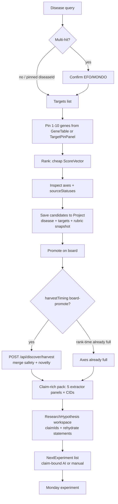
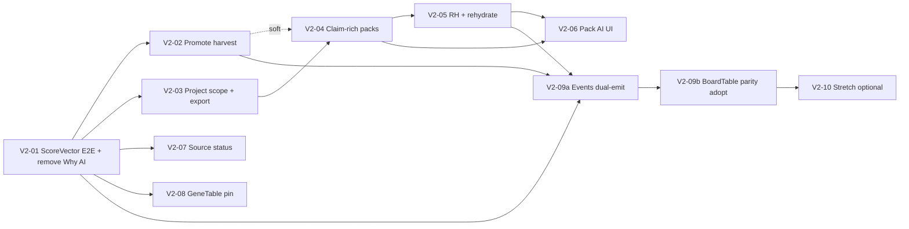

# BioIntel Discovery Workbench v2 — Design Document

**Product:** BioIntel Discovery Workbench (continuation of v1, main @ `6185643`)  
**Audience:** Implementers (engineers / agents) working in `C:\Users\kevin\workspace\kBioIntelBrowser04052026`  
**Author role:** Principal product + systems design  
**Date:** 2026-07-16  
**Status:** Implementable redesign — **Rev 1.2** (residual re-review polish)  
**Constraint law (binding):** Free public APIs only; evidence-first; no regulatory decision support; solo + file export default (share optional); deterministic ranking without LLM; **AI only claim-bound on packs/hypotheses** (no free-form Discover ranking rationales)  
**Beachhead:** Target-led small-molecule repurposing / early candidate triage (academic, rare-disease, translational)  
**Canonical project copy:** `docs/design/discovery-workbench-v2.md` (must stay identical to this document)  
**Predecessor:** `docs/design/discovery-workbench-v1.md` (Rev 3)

---

## 0. Strategic north star

> **When a bioengineer opens BioIntel, they leave with a shortlist they trust, a cited pack, a written hypothesis, and a concrete Monday experiment — not a pile of panels.**

v1 built the *parts* of the workbench. v2 **closes the scientific loop end-to-end** and makes ranking **scientifically defensible** in the UI the user actually sees.

### North-star outcome loop

```
Disease confirm → pin targets → ranked shortlist (multi-axis, inspectable)
  → save + promote (safety harvest) → claim-rich evidence pack
  → ResearchHypothesis (claim-bound) → NextExperiment[]
  → Monday assay / literature / target validation
```

Everything in this document advances at least one arrow. Features that do not are deferred (stretch or non-goals).

---

## 1. Relationship to v1

### 1.1 What v1 shipped (keep)

| Area | Status on main | Paths |
|---|---|---|
| Disease multi-hit confirm | Shipped | `DiseasePicker`, `useDiscovery`, `v2.needsDiseaseConfirmation` |
| Multi-axis engine + prefs | Engine shipped; **UI still legacy** | `src/lib/discovery/scoreAxes.ts`, `preferences.ts`, `harvest.ts` |
| OT knownDrugs + ChEMBL-by-target | Shipped | `sources/knownDrugs.ts`, `sources/chemblByTarget.ts` |
| Identity InChIKey | Shipped | `identityResolve.ts`, `IdentityTrustBadge` |
| TargetPinPanel | Shipped (pins via URL/state) | `src/components/discover/TargetPinPanel.tsx` |
| Local projects board | Shipped | `src/lib/project/store.ts`, `/projects/[id]` |
| Set-ops → board bridge | Shipped | `bridgeFromIntersect.ts` |
| Evidence packs download + optional share | Shipped | `PackBuilder`, `pack.ts`, snapshot share when collab mode |
| Decision profile + DecisionStrip | Shipped | `ProfileModeToggle`, `DecisionStrip` |
| Signals deep-links | Shipped | `src/lib/signals/**`, `SignalBadges` |
| Pack AI API + validation | API only | `POST /api/ai/pack`, `validateOutput.ts`, `contracts.ts` |
| ResearchHypothesis store | Seed only | `researchHypothesis.ts` |
| productEvents | Partial / divergent names | `src/lib/productEvents.ts` |

### 1.2 What v1 left half-built (v2 closes)

| # | Breaker | Current evidence | v2 close |
|---|---|---|---|
| L1 | Multi-axis `ScoreVector` computed but Discover cards show **LEGACY** bars | `CandidateCard.tsx` legacy bars + ScoreExplainer 35/25/20/20; page never passes `domainCandidate` | Wire ScoreVector E2E; shared `AXIS_ORDER` |
| L2 | Save-to-project drops domain richness | Legacy mapper without InChIKey when prop omitted | Always pass `v2` candidate; `mergeMoleculeCandidate` |
| L3 | Promote does **not** trigger safety harvest | `handleStatus` only `setBoardStatusAndSave` | Promote → harvest (watching does **not**) |
| L4 | Project.disease / targets / rubric not set on save-from-Discover | `SaveToProjectButton` name only | Scoped create + export round-trip |
| L5 | ResearchHypothesis list+seed only; `claimIds=[]` | Seed hardcodes empty claimIds; no editor | Workspace + claimIds + **rehydrate statements** |
| L6 | Pack AI API exists; PackBuilder has **zero AI UI** | Header comment aspirational only | PackAiPanel; fix comment |
| L7 | Board PackBuilder often claim-empty | No Core panels | Extractor-backed 5-panel batch + multi-CID merge |
| L8 | `sourceStatuses` never rendered on Discover | Engine returns them; page ignores | SourceStatusStrip |
| L9 | GeneTable not interactive pin | Links to `/gene` only | Pin chip; max **10** |
| L10 | Event names diverge from design M1–M9 | Different names **and** M-labels | Full dual-emit matrix; split PR |
| L11 | `BoardTable.tsx` unused | Inline table has Signals + ≈ similar | Parity checklist before adopt |
| L12 | Fake progress stages for analytics | Timer-driven `discover_stage` | Real pipeline stages only |
| L13 | Free-form Discover “Why ranked?” AI | `WhyRationalePanel` / no claim allowlist | **Remove in V2-01** (constraint law) |

### 1.3 v1 DoD gaps addressed by v2

1. **ResearchHypothesis + next experiments** → PR-V2-05  
2. **Promote → harvest** → PR-V2-02  
3. **Score transparency** → PR-V2-01  

### 1.4 What stays unchanged (law continuity)

- Free public APIs only; no DrugBank/Cortellis  
- Preferences law (KD21): Balanced / Soft AE / Board-promote / Solo export / Mixed tour defaults  
- ResearchHypothesis ≠ set-ops `/hypothesis` (KD17)  
- Download-primary packs; local-first projects  
- Ranking deterministic; no LLM in rank path  
- Molecule profiles remain depth stations  
- Dual schema RankResult + `v2` remains wire contract  

---

## 2. Overview

v2 is a **loop-completion release**, not a greenfield redesign.

**Phase A — Trust the shortlist:** multi-axis scores everywhere; save preserves identity + scores; project scoped to disease/targets/rubric; source status honesty; pin-from-gene-table; remove free-form Why AI.

**Phase B — Leave with Monday’s work:** promote harvest; claim-rich board packs (extractor-correct); RH editor with claim rehydrate; NextExperiment[]; Pack AI UI; product events that measure M1.

**Phase C (optional stretch):** Pharos TDL badge (acceptance criterion below), OT novelty refinements, Orphanet rare-disease mode, project dashboard home — only after A+B DoD.

---

## 3. Background & Motivation

### 3.1 Problem restated

A researcher can already rank candidates, save names to a board, download a pack (often empty claims), and seed a hypothesis with **no claims** — and still cannot answer Monday’s experiment question. Failure mode is **disconnected surfaces**, not missing APIs.

### 3.2 External free-API research (depth not breadth)

**Win with:** OT associations/clinical precedence, safety as scored signals (not raw FAERS dumps), rare-disease genetics (Orphanet/ClinVar/OT), versioned packs, next-experiment engine.

**Prefer:** Open Targets GraphQL, ChEMBL, CT.gov, openFDA, Orphanet, ClinVar, Pharos (stretch), Reactome, EuropePMC, GtoPdb/IUPHAR, PubChem identity.

**Skip in v2:** more Experimental panels, biologics entity model, multi-tenant cloud as requirement, de novo generative chemistry, paid DBs.

---

## 4. Goals & Non-Goals

### 4.1 Goals

| ID | Goal | Success signal |
|---|---|---|
| G1 | Multi-axis ScoreVector is the **only** score UI on Discover, board, decision strip | Shared `AXIS_ORDER`; no legacy 35/25/20/20; no free-form Why AI |
| G2 | Save/promote preserve domain candidate (InChIKey, scores, origins) | Board shows trust + composite + null safety until harvest |
| G3 | **Promote** (default prefs) runs safety/novelty harvest | After promote, axes fill or show epistemic empty/error |
| G4 | Projects carry disease, targetIds, rubric (+ prefs snapshot) from Discover | Export JSON round-trips fields |
| G5 | Board packs have claims when ≥1 candidate with CID | Happy path ≥6 claims; extractor keys only |
| G6 | ResearchHypothesis editor + claimIds + **rehydrated statements** + NextExperiment[] | Reload still shows claim text via rebuild |
| G7 | Pack AI UI with refuse path | Uses `minClaimsForPackMode` SSOT |
| G8 | Source statuses visible on Discover | Core source chips |
| G9 | Gene table pins targets | Max **10** (engine cap) |
| G10 | Product events measure real M1 | Dual-emit matrix; real stages |

### 4.2 Non-goals (explicit)

| Non-goal | Why |
|---|---|
| Regulatory decision support | Liability + wrong product |
| Paid DB depth | Free-API-only law |
| Biologics / gene-therapy first-class entities | Different identity graph |
| Multi-tenant cloud project DB as requirement | Solo + export default |
| De novo generative chemistry | Trust bar |
| LLM ranking or score invention | Deterministic ranking law |
| Free-form AI rationales on Discover shortlist | Constraint: AI claim-bound only on packs/hypotheses |
| More Experimental API panels | Breadth tax |
| Unifying ResearchHypothesis with set-ops Hypothesis | KD17 |
| Replacing PubChem / ChEMBL / OT as systems of record | We orchestrate and cite |
| Full redesign of molecule browser IA | Profiles stay depth stations |
| “This drug will work” predictions | Investigation priority only |

---

## 5. User journeys (loop completion)

### 5.1 Primary journey (v2 happy path)



| Step | User action | System | Primary files |
|---|---|---|---|
| 1 Frame | Disease search / confirm | Multi-hit picker | `DiseasePicker`, `useDiscovery` |
| 2 Pin | GeneTable pin + TargetPinPanel | URL `targets=` (max 10) | `discover/page.tsx` |
| 3 Rank | Run discover | Cheap multi-axis; SourceStatusStrip; **no Why AI** | `engine`, `CandidateCard` |
| 4 Save | Save to project | `mergeMoleculeCandidate`; stamp scope | `SaveToProjectButton`, `store.ts` |
| 5 Promote | Status → **promote** only | Harvest if needed | `boardHarvest.ts` |
| 6 Pack | Build pack | 5 extractor panels; multi-CID merge | `packClaims.ts`, `PackBuilder` |
| 7 Hypothesis | Open / edit RH | Rehydrate claims; thesis; next experiments | `/projects/.../hypothesis/[hid]` |
| 8 AI / Monday | Pack AI or manual NextExperiment | Claim-bound; refuse if empty | `PackAiPanel` |

### 5.2 Secondary journeys

| Journey | Entry | v2 delta |
|---|---|---|
| Target-first | `/gene/[id]` → Discover with pin | Pin URL |
| Molecule-first | Profile decision mode | Shared `AXIS_ORDER`; project deep-link preferred for scores |
| Set-ops | `/hypothesis` → board | Bridge; scores optional |
| Rank-time safety | Prefs harvestTiming | Unchanged |
| Return | `/projects` | Stretch dashboard |

### 5.3 Anti-journeys

- Show legacy score methodology while engine uses multi-axis  
- Free-form “Why ranked?” inventing narrative without claims  
- Seed hypothesis with empty claims and call it evidence-based  
- Dump raw FAERS tables on Discover  
- Auto-harvest on every **watching** toggle  
- Silent promote without harvest when timing is board-promote  

---

## 6. Proposed Design

### 6.1 Architecture (delta only)

```
src/
  app/discover/
    page.tsx                 # domainCandidate zip; SourceStatusStrip; GeneTable pin
    components/
      CandidateCard.tsx      # ScoreVector only; remove WhyRationalePanel
      ScoreAxisBars.tsx      # NEW shared multi-axis display
      SourceStatusStrip.tsx  # NEW
    hooks/useDiscovery.ts    # real stage events only
  app/projects/
    [id]/page.tsx             # promote harvest; PackBuilder; seed claimIds
    [id]/hypothesis/[hid]/page.tsx  # NEW RH workspace + rehydrate
  components/
    evidence/PackBuilder.tsx + PackAiPanel.tsx
    projects/BoardTable.tsx  # parity props before adopt
    projects/SaveToProjectButton.tsx
  lib/
    domain/score.ts + profileMode.ts   # shared AXIS_ORDER
    project/
      store.ts               # mergeMoleculeCandidate
      boardHarvest.ts        # NEW
      packClaims.ts          # NEW — extractor-correct fetch + merge
      researchHypothesis.ts  # update/append + rehydrate helpers
      packCache.ts           # NEW — IDB LRU helper required in V2-05; graceful if IDB missing
    productEvents.ts         # dual-emit matrix
    evidence/extractAll.ts   # unchanged keys (consume only)
```

### 6.2 Phase A — ScoreVector E2E (scientifically defensible ranking)

#### 6.2.1 Shared axis order (single source of truth)

**Lock:** One export used by ScoreAxisBars, DecisionStrip, BoardTable, ScoreExplainer.

```ts
// src/lib/profileMode.ts — update in PR-V2-01 (replaces current efficacy-first order)
export const AXIS_ORDER: ScoreAxisKey[] = [
  'clinicalStage',  // clinical precedence first (OT-inspired product pattern)
  'efficacy',
  'safety',
  'novelty',
  'identityTrust',
]
```

`AXIS_LABELS` stays. DecisionStrip already imports `AXIS_ORDER` — updating the array is enough for profile parity. Do **not** maintain a second order in discover components.

#### 6.2.2 Discover cards

**Bug:** `discover/page.tsx` maps legacy DTOs without `domainCandidate`.

**Legacy ↔ v2 matching (required):**

1. Engine dual-schema contract: `mapRankResultToDiscoveryResult` builds `v2.candidates` by **index-aligned** map over `rank.candidates` (`mappers.ts`); identity resolve mutates v2 in place in the same order (`engine.ts` / `applyResolvedIdentities`).  
2. **Primary pairing:** `domainCandidate = result.v2.candidates[i]` when `result.v2.candidates.length === result.candidates.length`.  
3. **Fallback** (length mismatch / partial failure only): match by `pubchemCid === legacy.cid`, then by normalized name; never invent scores.  
4. Regression: ATTR-like / EGFR-like fixtures assert pair integrity (same length + CID/name consistency).

**UI changes:**

1. Pass `domainCandidate` + `rubric` from result.  
2. Replace legacy bars + hardcoded ScoreExplainer with **`ScoreAxisBars`** + weight-aware explainer from `result.rubric` / prefs.  
3. **Composite ring** uses `domainCandidate.scores.composite` (legacy `compositeScore` only if v2 missing — should not happen after successful rank).  
4. Null axes → epistemic chip (`not-retrieved` / `empty` / `error`) — never paint 0 as “bad safety”.  
5. `safetyFlags` as yellow badges (soft-flag path).  
6. **Remove `WhyRationalePanel` and `buildDiscoverRationalePrompt` usage from CandidateCard** (see §6.2.5).  

**V2-01 UI checklist (must all land in same PR):**

- [ ] Axis bars from ScoreVector  
- [ ] Composite ring from `scores.composite`  
- [ ] Explainer shows five axes + live weights (not 35/25/20/20)  
- [ ] Molecule link score path (§6.2.4)  
- [ ] `domainCandidate` always passed when v2 present  
- [ ] SaveToProject receives domain candidate  
- [ ] Why AI removed  

```ts
// src/app/discover/components/ScoreAxisBars.tsx
export interface ScoreAxisBarsProps {
  scores: ScoreVector
  rubric?: ScoreRubric
  compact?: boolean
  onOpenBreakdown?: () => void
}
// Renders axes in AXIS_ORDER from profileMode
```

#### 6.2.3 Save preserves domain candidate + merge rules

**Bug:** Without domain prop, mapper rebuilds identity without InChIKey.

**Fix:** Always pass v2 candidate. Harden store with pure merge:

```ts
// src/lib/project/store.ts (or domain/mergeCandidate.ts)
export function mergeMoleculeCandidate(
  existing: MoleculeCandidate,
  incoming: MoleculeCandidate,
): MoleculeCandidate
```

**Rules (unit-test each):**

| Field | Rule |
|---|---|
| `candidateId` | Prefer `incoming` if non-empty; else existing (ids should match on call) |
| `identity.inchiKey` | Prefer non-empty over empty |
| `identity.chemblId` / `smiles` / `chebiId` / `drugbankId` | Prefer non-empty over empty |
| `identity.pubchemCid` | Prefer non-null over null |
| `identity.alternateCids` | Union unique |
| `identity.name` | Prefer longer non-empty; if both non-empty keep existing unless incoming has higher trust |
| `identity.identityTrust` | Prefer higher rank: `high > medium > low > unresolved` |
| `origins` | Set union |
| `evidenceBreadthSources` | Set union |
| `links` | Concat + dedupe by `type+targetId+diseaseId` |
| `scores.axes.*` | Prefer non-null over null per axis; if both non-null prefer **incoming** (newer harvest/rank) |
| `scores.axisStatus.*` | Follow the axis value that was chosen |
| `scores.composite` | Recompute via `computeComposite` after axis merge using incoming.weights \|\| existing.weights \|\| project rubric |
| `scores.scorePhase` | Prefer `full` over `cheap` |
| `scores.safetyFlags` | Union by `kind+label` |
| `boardStatus` | Prefer **existing** if set (triage is board-owned); else incoming; default `untriaged` |

`addCandidateToProject` uses `mergeMoleculeCandidate` when same `candidateId` exists (not whole-object replace).

#### 6.2.4 Decision strip / profile deep-link

Profile already supports full ScoreVector via `?scores=` JSON and `?project=` lookup (`scoreVectorFromSearchParams`, `lookupProjectCandidateScores`).

**Canonical path (preferred):** Save to project first → open molecule with `?project={projectId}` (and optional `disease=`). DecisionStrip reads board scores — no URL size risk.

**Discover-without-save path:**

- Default: link keeps composite-only `score=` for rank display (backward compatible).  
- Optional compact `scores` query: only if JSON length ≤ ~1500 chars after `encodeURIComponent`; otherwise omit and show strip from project or composite-only.  
- Helper: `buildMoleculeLinkUrl({ cid, rank, diseaseName, scores?, projectId? })` in CandidateCard or `profileMode.ts`.  
- **PR ownership: V2-01** files include this helper + tests for length gate.

#### 6.2.5 Free-form Discover “Why ranked?” AI — removed

**Constraint law:** AI only claim-bound on packs/hypotheses.

**Verified violation:** `WhyRationalePanel` streams free-form Ollama via `buildDiscoverRationalePrompt` with **no claim allowlist**.

**Decision (KD-V2-17):** In **PR-V2-01**, remove `WhyRationalePanel` from CandidateCard (and stop importing the prompt). Ranking explanation is **deterministic ScoreAxisBars + rubric explainer only**. Claim-bound narrative AI lives exclusively on packs (V2-06) and RH next-experiment apply (V2-05/06).

Do not “grandfather” free-form Why AI — it violates the binding product law and invites score invention narrative.

#### 6.2.6 Board multi-axis + BoardTable parity

Replace inline table with `BoardTable` only after **feature parity** (see §6.2.6.1). Until then, either extend BoardTable in one PR that includes all props, or keep inline table with ScoreAxisBars until V2-09b.

##### 6.2.6.1 BoardTable parity checklist (required before adopt)

| Feature | Inline page today | BoardTable today | Required on adopt |
|---|---|---|---|
| IdentityTrustBadge + AlternateCids | Weak | Yes | Keep |
| Composite score | Yes | Yes | Keep |
| Multi-axis ScoreAxisBars / expand | No | No | **Add** |
| Status select | Yes | Yes | Keep |
| Signals column (`SignalBadges`) | Yes | **No** | **Add** via `signalRows` prop |
| ≈ similar expand | Yes (promote/watching + CID) | **No** | **Add** via `onExpandSimilar` |
| Remove candidate | Yes | Yes | Keep |
| Harvest spinner per row | No | No | **Add** via `harvestingIds` |
| Board “Load safety” CTA | No | No | Page-level + table hook |
| Deep-link `?project=` | Yes | Yes | Keep |

```ts
export interface BoardTableProps {
  project: Project
  onStatusChange: (candidateId: string, status: BoardStatus) => void
  onRemove: (candidateId: string) => void
  onHarvestRequest?: (candidateIds: string[]) => void
  harvestingIds?: string[]
  signalRows?: CandidateSignalRow[] | null
  signalsLoading?: boolean
  onExpandSimilar?: (candidate: MoleculeCandidate) => void
  expandBusyId?: string | null
}
```

**PR ownership:** Implement parity props in **PR-V2-09b** (BoardTable adopt). Harvest hooks may land earlier on the **inline** page in V2-02 without forcing incomplete BoardTable adopt.

### 6.3 Promote-time harvest

Default prefs: `harvestTiming: 'board-promote'` (v1 KD16).

**Lock (KD-V2-4 revised):** Auto-harvest runs only when status becomes **`promote`**.  
- **`watching` does not** auto-harvest (matches prefs copy: “after promote or Load safety scores”).  
- Soft-interest watching must not burn openFDA/EuropePMC quota.  
- Board CTA “Load safety scores” harvests all `promote` + optionally user-selected / all with missing axes (explicit action).

```
onStatusChange(candidateId, status):
  1. setBoardStatusAndSave
  2. emit board_status_changed { status }
  3. if status === 'promote'
       and harvestTiming === 'board-promote'
       and candidateNeedsHarvest(c):
         start harvest for that candidate (non-blocking)
  4. if status leaves promote mid-flight → mark request generation; ignore late merge
```

**Prefs source for harvest:**

| Input | Source |
|---|---|
| Rubric weights / preset | `project.rubric` if set; else live `loadDiscoveryPreferences()` → ScoreRubric |
| `aeAggressiveness` | Live discovery prefs (or `project.preferencesSnapshot.aeAggressiveness` if present) |
| Names | `identity.name` (API allows name-only — `POST /api/discover/harvest`, max **15** candidates) |

**Body shape (existing API):**

```ts
{
  candidates: Array<{
    name: string
    candidateId?: string
    scores?: ScoreVector
    phaseNorm?: number | null
    clinicalStage?: number | null
  }>  // 1–15
  runSafety?: boolean   // default true
  runNovelty?: boolean  // default true
  rubricPreset?: RubricPresetId
  aeAggressiveness?: AeAggressiveness
}
```

**Latency / cancel UX:**

- Row spinner while `harvestingIds` contains id  
- AbortController or generation counter: on unmount or status change away from promote, **ignore** late responses (do not overwrite board with stale full scores if user killed the candidate)  
- Soft client timeout aligned with harvest defaults (~4s safety / ~3s novelty per candidate, concurrency 4 server-side)  
- Partial merge OK: axes that returned merge; failed → axisStatus error/timeout  

```ts
// src/lib/project/boardHarvest.ts
export function candidateNeedsHarvest(c: MoleculeCandidate): boolean
export async function harvestCandidatesForBoard(
  project: Project,
  candidateIds: string[],
  opts: {
    rubric: ScoreRubric
    aeAggressiveness: AeAggressiveness
    signal?: AbortSignal
    generation?: number
  }
): Promise<{ project: Project; warnings: string[]; generation: number }>
```

### 6.4 Disease / target / rubric scoped projects

Stamp on create/save from Discover when fields empty:

| Field | Source |
|---|---|
| `Project.disease` | `result.v2.disease` |
| `Project.targetIds` | pinned targets (max 10) |
| `Project.rubric` | active ScoreRubric from prefs |
| `Project.preferencesSnapshot` | `snapshotDiscoveryPreferences()` |

Do not overwrite non-empty disease if different — toast “Saved to board (project already scoped to X)”.

**Migration:** Old localStorage projects without `preferencesSnapshot` remain valid (`isProject` ignores unknown; field optional). **Export/import must round-trip** the new field (`exportImport.ts` in V2-03).

UI: board header disease + target chips + rubric badge; deep-link back to `/discover?q=&diseaseId=&targets=`.

### 6.5 Claim-rich board packs (extractor-correct)

#### 6.5.1 Extractor contract (ground truth)

`extractClaimsFromCorePanels` (`src/lib/evidence/extractAll.ts`) accepts **only**:

| `CorePanelEvidenceInput` key | Extractor |
|---|---|
| `chemblMechanisms` | `extractClaimsFromChemblMechanisms` |
| `chemblActivities` | `extractClaimsFromChemblActivities` |
| `diseaseAssociations` | `extractClaimsFromOpenTargets` |
| `clinicalTrials` | `extractClaimsFromClinicalTrials` |
| `adverseEvents` | `extractClaimsFromAdverseEvents` |

`properties` and `chembl-indications` are decision panels for **profile UX** but **do not feed extractors today** — do **not** fetch them for board claim density unless extractors are extended later (out of v2 scope).

#### 6.5.2 Panel route / category → DTO mapping

Board fetch uses molecule **panel** routes (or category fetch then pick propKeys). Panel route returns `{ data, total, hasMore }` (`panel/[panelId]/route.ts`). Map `data` into `CorePanelEvidenceInput`:

| Board pack panel set | `PanelDef.id` / route `panelId` | `propKey` (categoryConfig) | → `CorePanelEvidenceInput` |
|---|---|---|---|
| Mechanisms | `chembl-mechanisms` | `chemblMechanisms` | `chemblMechanisms` |
| Activities | `chembl` | `chemblActivities` | `chemblActivities` |
| Trials | `clinical-trials` | `clinicalTrials` | `clinicalTrials` |
| AE | `adverse-events` | `adverseEvents` | `adverseEvents` |
| OT disease assoc. | `opentargets` | `diseaseAssociations` | `diseaseAssociations` |

**Note:** PANEL_CONFIG keys in the panel route file may use camelCase (`chemblActivities`, `diseaseAssociations`) for some panels — implementers must resolve **PanelDef.id → PANEL_CONFIG key** via existing panel registry / categoryConfig, not invent ids. Preferred helper path: reuse profile category load (`fetchCategoryData` / decision categories) then `corePanelsFromProfileData(mergedBag)` so propKeys match profile.

**OT / diseaseAssociations:** extractor is disease-association claims for the **molecule name**; project.disease is pack metadata context, not a required query param for the existing molecule panel fetcher. Still pass `disease` into `buildEvidencePack` for pack header + RH seed.

**Explicitly out of board batch:** full 15 Core panels, `properties`, `chembl-indications`, recalls-as-claims (unless future extractor).

#### 6.5.3 Fetch budgets

| Param | Value |
|---|---|
| Max candidates per pack build | **5** (prefer `promote`, then `watching`, then any with CID) |
| Panels per candidate | **5** (table above) |
| Concurrency | 2 candidates × 2 panels (or 3 total in-flight) |
| Per-request timeout | 8s soft; skip panel on fail (empty key) |
| Claim cap | 200 (`MAX_PACK_CLAIMS` / `DEFAULT_CLAIM_TOTAL_CAP`) |

#### 6.5.4 Multi-subject merge algorithm

```
for each selected candidate with pubchemCid (max 5):
  panels_i = fetchExtractorPanels(cid)  // CorePanelEvidenceInput
  claims_i = extractClaimsFromCorePanels(panels_i, {
    retrievedAt,
    subjectCandidateId: candidate.candidateId,
    moleculeName: candidate.identity.name,
  })
allClaims = dedupeClaimsById(concat(claims_i))
// Per-candidate extractClaimsFromCorePanels already facet-sorts when preferFacetOrder=true
// (sortByFacetPriority is private in extractAll.ts — do NOT call it).
// Optional: export a public sortClaimsByFacetPriority later; not required for v2 DoD.
// Global re-sort after concat is optional; default = omit (stable concat order is fine).
allClaims = slice(0, 200)
pack = buildEvidencePack({
  title,
  claims: allClaims,          // pre-extracted path
  candidates: selected,
  disease: project.disease,
  targets: resolveTargets(project),
  preferencesSnapshot,
  rubric: project.rubric,
  projectId: project.id,
})
```

One **multi-subject** pack (not one pack per candidate by default). `buildEvidencePack` already accepts pre-extracted `claims` — use that path when multi-CID; do not pass a single merged `panels` bag across molecules (would lose subject attribution).

#### 6.5.5 Index breadcrumb

```ts
export interface ProjectPackIndexEntry {
  id: string
  title: string
  createdAt: string
  candidateCount?: number
  claimCount?: number
  claimIds?: string[]      // ≤50 ids for RH seed
  contentHash?: string
}
```

`toProjectPackIndexEntry` must populate `claimCount`, `claimIds` (slice 50), `contentHash`.

### 6.6 ResearchHypothesis workspace + claim rehydrate

**Routes:** list on project page; editor `/projects/[id]/hypothesis/[hid]`.

**Seed:** never hardcode `claimIds: []` — use `entry.claimIds` from last pack index / built pack.

#### 6.6.1 Claim statement rehydrate (DoD-required)

Storing only claimIds is quota-safe but insufficient for editor UX after reload.

**DoD-required path (primary):**

1. On RH editor open, if `claimIds.length > 0` and no in-memory claim statements:  
2. Call `rehydrateClaimsForHypothesis(hyp, project)` which:  
   - **First** tries IDB pack cache by `hyp.packId` (`biointel-packs`, see below);  
   - **Else** rebuilds via `packClaims` for the pack’s candidate set (from project candidates ∩ hyp.candidateIds, or promoted with CID, max 5);  
   - Filters rebuilt claims to `hyp.claimIds` (preserve order of hyp.claimIds);  
   - Shows CTA “Rebuild evidence” on failure with error detail.  
3. User always sees statement text or an explicit rebuild error — never opaque ids alone as the happy path.

**IDB cache (in-scope for V2-05 — required helper module; graceful if IDB unavailable):**

| Store | Key | Value | Cap |
|---|---|---|---|
| `biointel-packs` (IndexedDB) | pack id | full `EvidencePack` JSON | **global LRU 20** (align §7.3) |

- Written on successful board pack build / download.  
- Never write full claims into localStorage.  
- If IDB unavailable (private mode, quota, API missing), rehydrate falls back to **rebuild only** — DoD still met.

```ts
updateResearchHypothesis(id, patch): StoreResult<ResearchHypothesis>
appendNextExperiments(id, experiments: NextExperiment[]): ...
rehydrateClaimsForHypothesis(hyp, project): Promise<EvidenceClaim[]>
```

### 6.7 Pack AI UI

**Backend:** `POST /api/ai/pack` modes already validated.

**UI gate:** call **`minClaimsForPackMode(mode)`** from `src/lib/ai/contracts.ts` as the **single source of truth**:

| Mode | minClaims (code) |
|---|---|
| `pack_gap_analysis` | **0** |
| `pack_executive_brief` | **3** |
| `pack_next_experiment` | **3** |
| `pack_red_team` | **3** |

Do **not** invent “brief is freer than gap” — gap is freest today. UI may still *recommend* ≥1 claim for gap analysis as a soft hint, but enable/disable must match the helper (or change the helper + tests in the same PR if product wants gap min ≥1).

Disable modes when `pack.claims.length < minClaimsForPackMode(mode)` before fetch; show refuse reason if API refuses.

**PR-V2-06:** also fix PackBuilder file header comment that claims AI modes exist when only download/share are present.

### 6.8 Source status + epistemic honesty on Discover

Render `result.v2.sourceStatuses` as SourceStatusStrip; emit `source_status_shown` once per successful rank.

Copy: “Scores are investigation priority aids, not predictions of clinical success. Empty safety ≠ safe.”

### 6.9 Interactive target pin from GeneTable

Pin toggles symbol in `state.targets` via `setTargets` + `syncTargetsUrl`.  
**Max 10** (existing engine/API/useDiscovery cap — not “5–10”).  
Visual filled pin when already pinned; optional “Re-rank with pins”.

### 6.10 Product events realignment

#### 6.10.1 Metric ontology

Analytics is **internal-only** (solo product, best-effort `/api/analytics`) — clean-cut is acceptable, but **dual-emit for one PR cycle** keeps any local dashboards from going dark.

**M1** = funnel completion (not a single event). Individual events below feed M1–M9.

#### 6.10.2 Full old → new dual-emit matrix

| Current `ProductEventName` | Old informal M | Canonical v2 name | v2 metric | Emit sites today |
|---|---|---|---|---|
| `discover_search` | M1 | `discover_started` | M1 | `useDiscovery` |
| `discover_disease_confirm` | M2 | `discover_disease_confirmed` | M1 | `useDiscovery` |
| `discover_rank_complete` | M3 | `discover_rank_completed` | M1 | `useDiscovery` |
| `discover_stage` | progressive | `discover_stage` | M7 | `useDiscovery` — **real stages only** |
| `discover_prefs_change` | M9 | `preference_changed` | M4/M9 | `useDiscovery` |
| `project_create` | M4 | `project_create` | M8 support | SaveToProject, projects page |
| `project_add_candidate` | M5 | `board_candidate_added` | M1 | `SaveToProjectButton` |
| `pack_export` | M6 | `pack_exported` | M1/M3 | `PackBuilder` |
| `pack_share` | — | `pack_share` | optional | `PackBuilder` |
| `decision_mode_open` | M7 | `decision_mode_open` | keep (profile) | `ProfilePageClient` |
| `hypothesis_send_to_board` | M8 | `hypothesis_send_to_board` | keep (set-ops) | `HypothesisClient` |
| `similarity_expand` | — | `similarity_expand` | keep | project board |
| *(missing)* | — | `board_status_changed` | M2 | board status select |
| *(missing)* | — | `project_opened` | M8 | project board mount |
| *(missing)* | — | `research_hypothesis_opened` | M1 | RH editor mount |
| *(missing)* | — | `pack_opened` | M1 | PackBuilder open/build |
| *(missing)* | — | `score_breakdown_opened` | M4 | Score explainer |
| *(missing)* | — | `harvest_safety_done` | M7 | boardHarvest complete |
| *(missing)* | — | `source_status_shown` | M6 | SourceStatusStrip |
| *(missing)* | — | `ai_response` | M5 | PackAiPanel |
| *(missing)* | — | `rubric_changed` | M4 | RubricEditor |
| *(missing)* | — | `preference_tooltip_opened` | M9 | prefs tooltips |

**Dual-emit helper:**

```ts
emitProductEventCanonical(newName, props)
// also emits legacy alias when mapping exists, for one release
```

**Deprecations:** After dual-emit PR merges and one release, drop legacy names from the union. `decision_mode_open` and `hypothesis_send_to_board` **stay** (still valid product events; only M-number labels were wrong).

#### 6.10.3 Real stages (kill fake progress) — post-hoc from `timingMs`

**Context:** Client `useDiscovery` awaits a **monolithic** `POST /api/discover/rank` (plus optional separate harvest). Mid-pipeline stages are **not** separately observable without SSE. Engine already returns `v2.timingMs` with `DiscoveryTimingStage` keys (`src/lib/domain/discoveryResult.ts`):

```ts
export type DiscoveryTimingStage =
  | 'disease' | 'targets' | 'gather' | 'identity'
  | 'cheapScore' | 'safetyHarvest' | 'total'
```

**V2-09a rules (locked — no rank SSE in v2):**

1. Timer-driven UX progress animation may remain for perceived responsiveness, but **must never** emit `discover_stage` analytics (kills L12 fake stages).  
2. After rank resolves successfully, emit `discover_stage` **post-hoc / batch** for each key present on `result.v2.timingMs` **except** pure `total` (or include `total` once as summary — implementer choice; prefer emit non-total stages + one `total` prop on rank_completed).  
3. **Stage name SSOT:** use `DiscoveryTimingStage` string values **as-is** (`cheapScore`, `safetyHarvest` — camelCase). Do **not** invent snake_case (`cheap_score`) in event props.  
4. Board promote / board CTA harvest: emit `discover_stage` with `stage: 'safetyHarvest'` (and/or `harvest_safety_done`) when client harvest completes — this is the only mid-session stage that is truly progressive outside rank.  
5. Optional client-only wrapper stages (`discover_started` already covers submit) — no fabricated intermediate emits while rank is in flight.

| `discover_stage` prop `stage` | When emitted |
|---|---|
| `disease` | Post-rank if `timingMs.disease` defined |
| `targets` | Post-rank if `timingMs.targets` defined |
| `gather` | Post-rank if `timingMs.gather` defined |
| `identity` | Post-rank if `timingMs.identity` defined |
| `cheapScore` | Post-rank if `timingMs.cheapScore` defined |
| `safetyHarvest` | Post-rank if present **or** client board harvest complete |
| `total` | Optional once with duration; prefer on `discover_rank_completed` props |

```ts
// useDiscovery after rank success — illustrative
for (const [stage, ms] of Object.entries(data.v2?.timingMs ?? {})) {
  if (stage === 'total') continue
  emitProductEventCanonical('discover_stage', { stage, ms, source: 'rank_timingMs' })
}
```

### 6.11 Stretch (Phase C — after A+B)

| Stretch | Acceptance (if built) |
|---|---|
| Pharos TDL badge | GeneTable or TargetPinPanel shows TDL (Tclin/Tchem/Tbio/Tdark) from existing `pharos.ts` when fetch succeeds; hidden on empty/error |
| Orphanet rare mode | Stretch only — unspecified beyond optional target-list bias; not DoD |
| Project dashboard | `/projects` shows last-opened + promote counts |

---

## 7. Data Model Changes (minimal)

### 7.1 Keep as-is

`ScoreVector`, `MoleculeCandidate`, `ResearchHypothesis`, `NextExperiment`, `EvidenceClaim`, `DiscoveryResult` schemaVersion 2.

### 7.2 Additive only

```ts
export interface Project {
  schemaVersion: 1  // keep; additive fields OK
  // ...existing...
  preferencesSnapshot?: DiscoveryPreferencesSnapshot
}

export interface ProjectPackIndexEntry {
  id: string
  title: string
  createdAt: string
  candidateCount?: number
  claimCount?: number
  claimIds?: string[]  // ≤50
  contentHash?: string
}

export interface ProjectScopeContext {
  disease?: DiseaseEntity | null
  targetIds?: string[]
  rubric?: ScoreRubric
  preferencesSnapshot?: DiscoveryPreferencesSnapshot
}
```

### 7.3 Storage policy

| Entity | Store | Cap |
|---|---|---|
| Project | `biointel-project-v1-{id}` | 50 candidates |
| ResearchHypothesis | `biointel-research-hypothesis-v1-{id}` | 20k thesis; 30 RH/project |
| Pack index | metadata + claimIds ≤50 | no full claims |
| Full packs | download-primary + **IDB `biointel-packs` LRU** | ≤200 claims; ≤20 packs |
| Prefs | `biointel-discovery-prefs-v1` | single blob |

QuotaExceeded → export prompt; never silent drop.

---

## 8. API / Interface Changes

### 8.1 No new paid endpoints

### 8.2 Existing APIs

| API | v2 consumer |
|---|---|
| `GET/POST /api/discover/rank` | v2 UI wire |
| `POST /api/discover/harvest` | promote + board CTA (max 15, name-only OK) |
| `POST /api/ai/pack` | PackAiPanel |
| `/api/molecule/[id]/panel/*` or category routes | packClaims 5 extractor panels |
| `/api/analytics` | dual-emit events |

### 8.3 No new server batch required by default

Client-side `packClaims` is default. Optional `POST /api/discover/core-evidence` only if waterfalls fail latency targets — not in critical path.

### 8.4 Component interfaces

```ts
// CandidateCard — no WhyRationalePanel
domainCandidate?: MoleculeCandidate
rubric?: ScoreRubric

// SaveToProjectButton
projectContext?: ProjectScopeContext

// BoardTable — full parity props §6.2.6.1

// PackBuilder
autoFetchCore?: boolean  // uses packClaims 5-panel set
promotedOnly?: boolean   // prefer promote; fallback watching/CID
onPackBuilt?: (pack: EvidencePack) => void
showAi?: boolean

// PackAiPanel
pack: EvidencePack
hypothesisId?: string
onApplyNextExperiments?: (exps: NextExperiment[]) => void
// gate with minClaimsForPackMode
```

---

## 9. Alternatives Considered

| Alternative | Decision | Rationale |
|---|---|---|
| Keep free-form Why AI with disclaimer | **Reject** | Violates binding claim-bound AI law |
| Harvest on watching | **Reject** | Prefs copy + quota; promote-only auto |
| IDs-only RH editor forever | **Reject** | DoD requires rehydrate |
| clinicalStage-first vs efficacy-first dual orders | **Reject dual** | Single `AXIS_ORDER`; clinicalStage first |
| V2-04 hard-depends V2-02 | **Soft-dep only** | Claims need CIDs, not promote |
| Server project DB for packs | Defer | Solo + export + IDB cache |
| Unify Hypothesis types | Reject | KD17 |
| LLM rewrite scores | Reject | Deterministic ranking |
| Big-bang drop dual schema | Defer | Additive RankResult useful |

---

## 10. Security & Privacy

Local-first; no patient data; pack AI claim allowlist; Ollama URL validation; analytics best-effort no secrets; no clinical decision support.

---

## 11. Observability

### 11.1 M1 funnel

```
discover_started
  → discover_disease_confirmed?
  → discover_rank_completed
  → board_candidate_added
  → board_status_changed{status:promote}?
  → harvest_safety_done?
  → pack_exported
  → research_hypothesis_opened
```

### 11.2 Supporting metrics

M2 status distribution · M3 `pack_exported` claimCount · M4 score/pref inspect · M5 `ai_response` refused · M6 source_status_shown · M7 real stages + timing · M8 project_opened · M9 tooltips.

Internal-only analytics → dual-emit one release then clean-cut OK.

---

## 12. Risks

| Risk | Mitigation |
|---|---|
| Dual score systems | Hard-cut UI to ScoreVector in V2-01 |
| Promote harvest latency | Non-blocking spinner; ignore late if status ≠ promote |
| Panel id / DTO mismatch | Fixed mapping table §6.5.2; prefer category+propKey path |
| Claim rehydrate failure | Explicit Rebuild CTA; IDB cache |
| BoardTable regression | Parity checklist §6.2.6.1; split V2-09b |
| Event rename breaks dashboards | Dual-emit matrix §6.10.2 |
| AI without claims | minClaimsForPackMode gate |
| Project disease overwrite | Fill empty only |
| Watching quota burn | Promote-only auto-harvest |
| Free-form Why AI drift | Removed in V2-01 |

---

## 13. Rollout Plan

| Wave | Theme | PRs | Exit |
|---|---|---|---|
| Wave 1 | Score trust | V2-01, V2-03, V2-07, V2-08 | Multi-axis; no Why AI; sources; pins; scoped project |
| Wave 2 | Board loop | V2-02, V2-04 | Promote harvest; claim-rich packs |
| Wave 3 | Hypothesis + AI | V2-05, V2-06 | RH rehydrate; Pack AI |
| Wave 4 | Measurement + table | V2-09a, V2-09b | Events; BoardTable parity |
| Wave 5 | Stretch | V2-10 | Optional |

---

## 14. Definition of Done — Workbench v2

A researcher can, in one session, free APIs only:

1. Confirm disease and pin targets from GeneTable (max 10),  
2. See multi-axis scores (shared AXIS_ORDER) + source statuses; **no free-form Why AI**,  
3. Save candidates with InChIKey + ScoreVector into disease-scoped project,  
4. **Promote** and obtain safety/novelty harvest under default prefs,  
5. Build a pack with **≥6 claims** via extractor-backed 5 panels (happy path public data),  
6. Seed and edit ResearchHypothesis with non-empty claimIds and **visible claim statements after reload** (rehydrate),  
7. Produce ≥1 NextExperiment (manual or claim-bound AI),  
8. Export pack + project files (prefs snapshot round-trips),  
9. Emit measurable M1 chain without fake stages.

**v2 north metric:** M1 loop completion ↑; M3 median claimCount on board-origin packs ≥ 5.

---

## 15. Open Questions

**None that block implementation.** Defaults locked:

| Topic | Default |
|---|---|
| AXIS_ORDER | clinicalStage first (shared) |
| Auto-harvest | **promote only** |
| Pack panels | 5 extractor-backed only |
| Multi-CID pack | One pack; concat+dedupeClaimsById; cap 200 |
| RH rehydrate | IDB cache + on-demand rebuild (DoD) |
| Discover Why AI | Removed |
| Events | Dual-emit one release; internal analytics |
| Gene pins | Max 10 |
| V2-04 deps | Hard: V2-03; soft: V2-02 |

---

## 16. Key Decisions (MANDATORY)

| # | Decision | Rationale |
|---|---|---|
| **KD-V2-1** | Theme = close loop + defensible ranking | Loop breakers block trust |
| **KD-V2-2** | ScoreVector sole score UI; shared AXIS_ORDER clinicalStage-first | Honesty + DecisionStrip parity |
| **KD-V2-3** | Always pass v2 candidate; `mergeMoleculeCandidate` rules | Fixes InChIKey/score drop |
| **KD-V2-4** | Auto-harvest on **promote only**; watching does not; board CTA for batch | Matches prefs copy + KD16 intent; protects quota |
| **KD-V2-5** | Stamp Project disease/targets/rubric/prefs snapshot; export round-trip | Reproducible triage |
| **KD-V2-6** | Board packs fetch **5 extractor-backed panels only**; multi-CID extract-then-concat | Matches extractAll; DoD claims |
| **KD-V2-7** | Pack index claimIds ≤50 + IDB full pack LRU for rehydrate | Quota-safe + editor UX |
| **KD-V2-8** | RH editor + rehydrate DoD + NextExperiment | Completes J6 |
| **KD-V2-9** | Pack AI UI only; remove free-form Discover Why AI | Constraint law |
| **KD-V2-10** | SourceStatusStrip required | Epistemic honesty |
| **KD-V2-11** | GeneTable pin max 10 | Engine cap |
| **KD-V2-12** | Full event dual-emit matrix; `discover_stage` post-hoc from `v2.timingMs` / `DiscoveryTimingStage` SSOT; no rank SSE | Measurable M1 without fake mid-pipeline emits |
| **KD-V2-13** | BoardTable adopt only with parity checklist | No Signals/≈ similar regression |
| **KD-V2-14** | Stretch after A+B; Pharos TDL has one acceptance criterion | Depth over cosmetics |
| **KD-V2-15** | Free APIs; no regulatory; solo+export | Binding law |
| **KD-V2-16** | No RH/set-ops type unify | KD17 |
| **KD-V2-17** | Remove WhyRationalePanel in V2-01 | AI claim-bound only |
| **KD-V2-18** | V2-04 soft-depends V2-02; hard-depends V2-03 | Parallelize critical path |
| **KD-V2-19** | Pack AI thresholds = `minClaimsForPackMode` SSOT | Prevent UI/server drift |
| **KD-V2-20** | Prefer project deep-link for DecisionStrip scores; compact URL optional | URL size safety |

---

## 17. PR Plan (MANDATORY) — ordered DAG



### PR-V2-01 — Wire multi-axis ScoreVector E2E + remove Why AI

**Title:** `feat(discover): ScoreVector UI, AXIS_ORDER, mergeCandidate, remove free-form Why AI`

**Files:**

- `src/app/discover/page.tsx` — index-aligned `domainCandidate`; zip test  
- `src/app/discover/components/CandidateCard.tsx` — bars, ring, explainer, link helper; **delete WhyRationalePanel**  
- `src/app/discover/components/ScoreAxisBars.tsx` — **new**  
- `src/lib/profileMode.ts` — `AXIS_ORDER` clinicalStage-first  
- `src/components/projects/SaveToProjectButton.tsx`  
- `src/lib/project/store.ts` — `mergeMoleculeCandidate`  
- `src/lib/domain/` — merge helper if preferred  
- `src/lib/profileMode.ts` or CandidateCard — `buildMoleculeLinkUrl` project/scores  
- Tests: pair integrity, merge rules, DecisionStrip order, no Why AI  

**Depends:** none  

**Description:** Sole multi-axis UI; V2-01 checklist §6.2.2; KD-V2-17.

---

### PR-V2-02 — Promote-time harvest + board CTA

**Title:** `feat(projects): promote-only safety harvest + Load safety CTA`

**Files:**

- `src/lib/project/boardHarvest.ts` — **new**  
- `src/app/projects/[id]/page.tsx` — promote handler; mid-flight ignore; CTA  
- Uses existing `POST /api/discover/harvest` (max 15)  
- Tests: needsHarvest; late response ignored; watching does not fetch  

**Depends:** PR-V2-01  

**Description:** KD-V2-4; prefs source §6.3.

---

### PR-V2-03 — Disease/target/rubric/prefs snapshot + export

**Title:** `feat(projects): scope stamp disease/targets/rubric; export round-trip`

**Files:**

- `SaveToProjectButton.tsx` — `projectContext`  
- `discover/page.tsx` / CandidateCard — pass context  
- `src/lib/project/store.ts` — createProject fields  
- `src/lib/domain/entities.ts` — `preferencesSnapshot?`  
- `src/lib/project/exportImport.ts` — **round-trip snapshot**  
- Board header chips  
- Tests: create scoped; import preserves snapshot; old projects load  

**Depends:** PR-V2-01  

---

### PR-V2-04 — Claim-rich board packs (5 extractor panels)

**Title:** `feat(evidence): packClaims 5-panel fetch; multi-CID merge; claimIds index`

**Files:**

- `src/lib/project/packClaims.ts` — **new** (mapping §6.5.2, merge §6.5.4)  
- `src/lib/domain/entities.ts` — ProjectPackIndexEntry fields  
- `src/lib/evidence/packIndex.ts` — claimIds/claimCount/contentHash  
- `src/components/evidence/PackBuilder.tsx` — autoFetchCore  
- `src/app/projects/[id]/page.tsx`  
- Optionally write IDB pack cache  
- Tests: mock panel responses → ≥N claims; multi-CID subjectCandidateId; prefer promote fallback watching/CID  

**Depends:** **hard** PR-V2-03; **soft** PR-V2-02 (promoted filter nicer, not required for CIDs)

---

### PR-V2-05 — ResearchHypothesis workspace + rehydrate

**Title:** `feat(hypothesis): RH editor, claim rehydrate (IDB+rebuild), NextExperiment`

**Files:**

- `src/app/projects/[id]/hypothesis/[hid]/page.tsx` — **new**  
- `src/lib/project/researchHypothesis.ts` — update/append  
- `src/lib/project/packCache.ts` — **new** IDB `biointel-packs`  
- `src/lib/project/packClaims.ts` — rehydrate helper  
- Project page seed with claimIds; link editor  
- Tests: seed claimIds; rehydrate from IDB; rebuild fallback  

**Depends:** PR-V2-04  

---

### PR-V2-06 — Pack AI UI

**Title:** `feat(ai): PackAiPanel with minClaimsForPackMode gates`

**Files:**

- `src/components/evidence/PackAiPanel.tsx` — **new**  
- `PackBuilder.tsx` — mount + **fix aspirational AI comment**  
- RH apply next experiments optional  
- `ai_response` events  
- Tests: gate uses helper; refuse UX  

**Depends:** PR-V2-04; soft PR-V2-05  

---

### PR-V2-07 — SourceStatusStrip

**Title:** `feat(discover): SourceStatusStrip + disclaimers`

**Files:** SourceStatusStrip **new**; discover page; `source_status_shown`  

**Depends:** none (∥ V2-01)  

---

### PR-V2-08 — GeneTable pin

**Title:** `feat(discover): pin targets from GeneTable (max 10)`

**Files:** discover page GeneTable; setTargets + URL  

**Depends:** none (∥ V2-01)  

---

### PR-V2-09a — Product events dual-emit + real stages

**Title:** `feat(analytics): dual-emit canonical events; discover_stage from timingMs`

**Files:**

- `src/lib/productEvents.ts` — names + dual-emit helper  
- `useDiscovery.ts` — stop timer analytics emits; post-hoc `discover_stage` from `v2.timingMs`  
- `boardHarvest.ts` / project page — `safetyHarvest` / `harvest_safety_done` on board harvest  
- All emit sites per §6.10.2 matrix  
- Tests: alias map; no emit during fake progress ticks; stage keys match `DiscoveryTimingStage`  

**Depends:** V2-01, V2-02; best after V2-05 for full funnel  

**Description:** Split from BoardTable; internal analytics clean-cut after dual-emit release. Stage SSOT = `DiscoveryTimingStage` / `timingMs` (§6.10.3). No rank SSE.

---

### PR-V2-09b — BoardTable parity adopt

**Title:** `feat(projects): adopt BoardTable with Signals, similar, harvest, axes`

**Files:**

- `BoardTable.tsx` — parity checklist §6.2.6.1  
- `projects/[id]/page.tsx` — replace inline table  
- Tests: BoardTable signals + expand + harvest spinner  

**Depends:** V2-09a; harvest CTA from V2-02  

---

### PR-V2-10 (stretch) — Pharos TDL + optional rare/dashboard

**Title:** `feat(stretch): Pharos TDL badge; optional rare mode; projects home`

**Acceptance (TDL only):** badge visible on pin/gene UI when Pharos returns TDL; absent on empty/error.

**Depends:** V2-09b DoD complete  

---

## 18. Testing strategy

| Layer | Focus |
|---|---|
| Pure | mergeMoleculeCandidate cases; packClaims mapping; dedupe multi-CID; minClaims helper; event alias map |
| Component | CandidateCard no Why AI; ScoreAxisBars AXIS_ORDER; SourceStatusStrip; PackAiPanel gates; BoardTable parity |
| Integration | index-aligned domainCandidate; promote harvest; watching no harvest; RH rehydrate |
| Golden | ATTR/EGFR pair integrity; soft vs hard AE fixtures unchanged |
| e2e smoke | optional discover → save → project |

---

## 19. References

| Ref | Path |
|---|---|
| v1 design Rev 3 | `docs/design/discovery-workbench-v1.md` |
| Score domain | `src/lib/domain/score.ts` |
| Extractors | `src/lib/evidence/extractAll.ts` |
| corePanelsFromProfileData | `src/lib/evidence/pack.ts` |
| Panel / propKey | `src/lib/categoryConfig.ts`, `panel/[panelId]/route.ts` |
| AXIS_ORDER | `src/lib/profileMode.ts` |
| Harvest API | `src/app/api/discover/harvest/route.ts` |
| Pack AI | `src/app/api/ai/pack/route.ts`, `minClaimsForPackMode` |
| Product events | `src/lib/productEvents.ts` |
| Timing stages SSOT | `src/lib/domain/discoveryResult.ts` (`DiscoveryTimingStage`, `timingMs`) |
| Why AI (remove) | `CandidateCard.tsx` WhyRationalePanel |

---

## Document control

- **Rev 1 (2026-07-16):** Initial v2 redesign.  
- **Rev 1.1 (2026-07-16):** Design-review patch — extractor panel mapping + multi-CID merge; RH rehydrate DoD (IDB+rebuild); remove free-form Why AI; promote-only harvest; full event dual-emit matrix; mergeMoleculeCandidate rules; legacy↔v2 index pairing; BoardTable parity checklist; PR split 09a/09b; V2-04 soft-dep; AXIS_ORDER SSOT; minClaimsForPackMode SSOT; export/import snapshot; harvest cancel/prefs; pin max 10; Pharos TDL acceptance.  
- **Rev 1.2 (2026-07-16):** Residual re-review polish — `discover_stage` post-hoc from `v2.timingMs` / `DiscoveryTimingStage` SSOT (no mid-rank SSE, no snake_case aliases); packCache required helper with graceful IDB miss; IDB global LRU **20** only; multi-CID merge does not call private `sortByFacetPriority`; summary artifact aligned.  
- **Canonical copies (must be identical):** design_doc_file path + `docs/design/discovery-workbench-v2.md`  
- Does not authorize: regulatory claims, paid APIs, biologics model, multi-tenant requirement, de novo gen chem, LLM ranking, free-form Discover AI rationales.  
- Engineering start: **PR-V2-01** ∥ **PR-V2-07** ∥ **PR-V2-08**.
