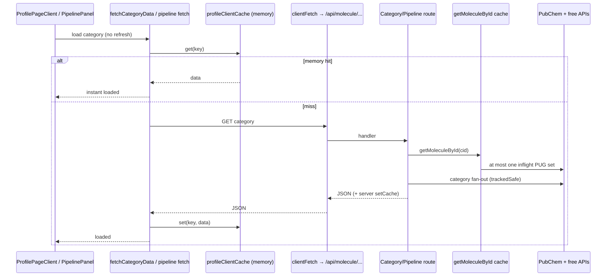

# Profile revisit cache — Design Document  
## Search-history reopen without multi-source stampede (session → IndexedDB)

**Product:** BioIntel Discovery Workbench (post-v2.1 local UX)  
**Audience:** Implementers (engineers / coding agents) in this repo  
**Author role:** Principal product + systems design  
**Date:** 2026-07-16  
**Status:** Implementable design — **Rev 1.1**  
  - **Phase A (session memory):** shipped  
  - **Phase A.1 (zero-flash peek):** shipped  
  - **Phase B (IndexedDB durability):** shipped (`profileRevisitIdb.ts` + L1/L2 wire + sidebar clear)  
**Constraint law (binding):** Free public APIs only; evidence-first; no regulatory decision support; **solo + file export default (localStorage / IDB / download)**; no multi-tenant cloud DB as a product requirement  
**Beachhead fit:** Reduces friction when a user reopens the same CID while building a shortlist / pack (M1 loop steps that leave and re-enter profile)  
**Canonical path:** `docs/design/profile-revisit-cache.md`  
**Related:**  
- `docs/design/discovery-workbench-v2.1.md` — G5 solo UX friction, Wave 3  
- `docs/design/agentic-workflow-cli.md` — agent entry points  
- Root `AGENTS.md`  
**As-built code (Phase A–B):**  
- `src/lib/profileClientCache.ts` — L1 memory + L2 bridge  
- `src/lib/profileRevisitIdb.ts` — IndexedDB store `biointel-profile-revisit`  
- `src/lib/fetchCategory.ts` — peek + async L1/L2 read  
- `src/components/profile/PipelinePanel.tsx`  
- `src/app/molecule/[id]/ProfilePageClient.tsx` — hydrate + forceRefresh invalidate  
- `src/components/layout/SearchHistorySidebar.tsx` — clear profile cache  
- Tests: `__tests__/lib/profileRevisitCache.test.ts`  
- Supporting reliability: `src/lib/api/pubchem.ts`, `src/lib/clientFetch.ts`

---

## 0. Problem statement

### 0.1 User-visible failure

When a researcher:

1. Opens a molecule profile (e.g. CID `3080836`) and waits for categories / pipeline to load  
2. Navigates away (Discover, another molecule, project board)  
3. Clicks the **same item in the left search-history sidebar**

…the profile shows **full “fetching data” again**, re-issuing pipeline + many category API calls. That feels broken for a “history” affordance and burns free-API budget.

### 0.2 Root cause (not a single bug)

| Layer | Behavior | Consequence |
|---|---|---|
| **Search history** | Stores `href`, title, kind, CID metadata only | Click = `router.push(href)` — **path bookmark**, not a payload restore |
| **React profile state** | `categoryData` / status live in `ProfilePageClient` | Unmount on navigation **wipes** loaded panels |
| **Server process cache** | `src/lib/cache.ts` TTL for category/pipeline aggregates | May make **second network** faster if same Node process + TTL hit; UI still shows loading + always pays RTT |
| **Discover rank cache** | `localStorage` rank results only | Does **not** cover molecule category payloads |
| **Sidebar Refresh (⟳)** | `?refresh=1&_t=…` | **Intentional** full re-query — correct product semantics |

The history UI previously implied “uses cache when available,” but molecule **panel data** was not client-cached. Misleading copy + real multi-source cost.

### 0.3 Secondary amplifiers (same sessions)

Documented here so revisit work is not confused with unrelated console noise:

| Amplifier | Symptom | Mitigation (shipped alongside) |
|---|---|---|
| **PubChem stampede** | Each category route called `getMoleculeById` independently → N concurrent PUG hits → 502/500 | In-flight de-dupe + process cache in `getMoleculeById` |
| **False 404** | Upstream flaky → `null` molecule → HTTP 404 | `PubChemUpstreamError` → **502** `retryable`; true miss → 404 |
| **No client retry** | HMR / one-shot 502 left panels red | `clientFetch` retries (404/429/500/502/503) on category + pipeline |
| **React stack walls** | Chrome attributes failed `fetch` with thousands of `reconnectPassiveEffects` frames | Noise only — count `GET … status` lines, not stack depth |
| **Stale `layout.js`** | `SyntaxError: Invalid or unexpected token` on `/_next/static/.../layout.js` | Dev artifact: hard reload / clear site data / wipe `.next`; layout unregisters SW on localhost |

---

## 1. Goals and non-goals

### 1.1 Goals

| ID | Goal | Success signal |
|---|---|---|
| **G-R1** | Reopen a **recently loaded** molecule from history without multi-source stampede | Categories already loaded this session appear **without** network (or with ≤1 instant cache hit per category) |
| **G-R2** | Preserve **Refresh** as the honest “live re-query” control | Sidebar ⟳ and `?refresh=1` bypass + invalidate client cache |
| **G-R3** | Stay solo-local (product law) | No cloud profile DB; no paid APIs |
| **G-R4** | Bound memory / disk | Explicit TTL + entry caps; never unbounded IDB growth |
| **G-R5** | Phase B: survive **full tab reload** for last N molecules | After hard reload, history open still restores Phase-A-class hit rate for capped set |

### 1.2 Non-goals

- **Not** offline-first entire product (no SW cache of all free APIs)  
- **Not** multi-device sync or shared team profile cache  
- **Not** caching raw upstream responses per-source (cache **route aggregates** only: category JSON, pipeline JSON)  
- **Not** replacing server `getCached` (still useful for first-load concurrent routes in one process)  
- **Not** changing Discover rank semantics (already has `DISCOVER_RANK_CACHE_KEY`)  
- **Not** silencing Chrome’s failed-request console (cannot hide intermediate 502 without avoiding the request)  
- **Not** evidence packs / board claims storage (already `packCache` IDB)  

### 1.3 Product-law alignment

```text
Solo + file export default (localStorage / IDB / download)
```

Profile revisit cache is a **local performance layer**, not a source of regulatory truth. Cached panels are **last successful free-API aggregates** with explicit freshness (fetched-at when present in UI). Refresh always available.

---

## 2. Architecture

### 2.1 Mental model

```
Search history (localStorage)     →  where did I go?  (href + meta)
Profile revisit cache (memory/IDB) →  what did I already load?  (category/pipeline JSON)
Server process cache (Node Map)    →  accelerate concurrent API handlers this process
Discover rank cache (localStorage) →  rank shortlist only
Pack IDB (biointel-packs)          →  evidence packs / RH rehydrate only
```

**Separation is intentional.** History stays small and durable; payloads stay in a dedicated cache with eviction.

### 2.2 Request path (after Phase A)



### 2.3 Cache key contract

| Kind | Key shape | Notes |
|---|---|---|
| Category | `category:{cid}:{categoryId}\|{overridesJson}\|{paramsJson}` | Empty overrides/params → trailing `\|\|` segment; must match `fetchCategoryData` |
| Pipeline | `pipeline:{cid}:` | No extra segment today; reserved for future query variants |

Helpers (Phase A):

```ts
// src/lib/profileClientCache.ts
profileCacheKey(kind: 'category' | 'pipeline', cid: number, extra?: string): string
getProfileClientCache<T>(key: string): T | undefined
setProfileClientCache(key: string, data: unknown, ttlMs?: number): void
deleteProfileClientCache(key: string): void
invalidateProfileClientCache(cid?: number): void  // one molecule or all
```

### 2.4 Invalidation / refresh semantics

| Trigger | Client memory | Server process cache | Network |
|---|---|---|---|
| Normal history open | **Read** if valid TTL | Unchanged | Skip if client hit |
| First open / cold | Miss | May hit | Full fetch |
| Sidebar **Refresh** ⟳ | `invalidateProfileClientCache(cid)` then fetch with `refresh=1` | Category route `forceRefresh` skips server getCached | Live |
| Panel Retry (pipeline) | `deleteProfileClientCache(pipeline key)` | N/A | Live |
| Full page reload | Phase A: **empty**; Phase B: hydrate from IDB | Survives only if same process | As needed |
| Dev server restart | Memory empty; server Map empty | Empty | Live |

### 2.5 What is *not* cached (Phase A/B default)

- Per-panel “refresh this card only” intermediate states beyond category blob  
- Gene-page specific routes unless later keyed the same way  
- Similar-molecules strip (optional stretch — separate key `similar:{cid}`)  
- AI / Ollama outputs  
- Analytics queues  

---

## 3. Phase A — Session memory (shipped)

### 3.1 Behavior

- **TTL default:** 45 minutes (`DEFAULT_TTL_MS = 45 * 60_000`)  
- **Max entries:** 120 (`MAX_ENTRIES`) — expired first, then insertion-order eviction  
- **Scope:** Same JS realm (SPA soft navigations, history clicks). Cleared on full reload.  
- **Wire-up:**  
  - `fetchCategoryData` — read before network; write after successful JSON  
  - `PipelinePanel` — same pattern; Retry deletes key  
  - `ProfilePageClient` forceRefresh effect — `invalidateProfileClientCache(cid)`  

### 3.2 UX copy

| Surface | Copy |
|---|---|
| History open button title | “Open {title} (session cache when previously loaded)” |
| History refresh button title | “Refresh — re-query sources for latest data” |

Do **not** claim “offline” or “always instant.”

### 3.3 Phase A DoD (acceptance)

- [x] Open molecule A, wait until ≥ tier-1 categories loaded, navigate to `/discover` or molecule B, open A from history → **no** multi-second category storm for already-cached categories (Network: 0 category GETs for hits, or only uncached tabs)  
- [x] History ⟳ still forces network for categories (`refresh=1`)  
- [x] Pipeline Retry forces network  
- [x] `npx tsc --noEmit` clean  
- [x] No localStorage for category blobs in Phase A (quota safety)  

### 3.4 Known Phase A limits

1. Full reload loses cache (motivates Phase B).  
2. Very large category JSON still holds RAM for up to 120 entries — cap + TTL mitigate.  
3. Soft-nav to same CID with different override/params uses different keys (correct).  
4. Loading overlay may still flash if many categories go `loading` even when each resolves sync from memory — **optional polish:** detect sync cache hit and set `loaded` without paint of full-page overlay (Phase A.1 micro).  

#### 3.4.1 Optional Phase A.1 — zero-flash restore

If cache hit is synchronous, `loadCategory` can:

```ts
const data = await fetchCategoryData(...) // resolves sync when memory hit
// Prefer: peek cache before setStatus('loading') to avoid overlay flicker
```

Implement as:

```ts
// fetchCategory.ts
export function peekCategoryClientCache(...): Record<string, unknown> | undefined

// ProfilePageClient loadCategory
const peeked = !opts?.refresh ? peekCategoryClientCache(...) : undefined
if (peeked) {
  setCategoryData(...); setCategoryStatus loaded; return
}
setCategoryStatus loading
// network path
```

**Priority:** low if users report only “slow,” high if they report “flash of loading despite instant data.”

---

## 4. Phase B — IndexedDB durability (follow-up)

### 4.1 Motivation

Researchers hard-refresh, close laptop lids, or recover from `layout.js` / Fast Refresh recovery paths. Session memory alone is insufficient for **return-within-day** workflows.

### 4.2 Storage design (mirror packCache patterns)

Reuse patterns from `src/lib/project/packCache.ts` (open DB, graceful null, LRU by `accessedAt`).

| Constant | Value | Rationale |
|---|---|---|
| DB name | `biointel-profile-revisit` | Isolated from packs |
| Store | `aggregates` | One store for category + pipeline |
| Version | `1` | Bump on schema change |
| Record key | same as `profileCacheKey(...)` | Unified keyspace with memory layer |
| LRU max **molecules** | **8** distinct CIDs | Not 120 blobs — group by cid for eviction |
| Max payload per record | **2.5 MB** serialized (skip write if larger) | Avoid QuotaExceeded; category aggregates can be fat |
| TTL | **24 hours** wall clock (`expiresAt`) | Fresher than packs; free APIs change slowly but honesty matters |
| Schema | `{ key, cid, kind, categoryId?, data, savedAt, accessedAt, expiresAt, bytes }` | Eviction + debug |

```ts
interface ProfileRevisitRecord {
  key: string
  cid: number
  kind: 'category' | 'pipeline'
  categoryId?: string
  data: unknown
  savedAt: string    // ISO
  accessedAt: string // ISO — LRU
  expiresAt: number  // epoch ms
  bytes: number      // approximate JSON size
}
```

### 4.3 Layering: memory L1 + IDB L2

```
get:
  1. memory hit → return
  2. IDB hit (not expired) → promote to memory → return
  3. network → write memory + async IDB put

set:
  memory always
  IDB put debounced (requestIdleCallback / setTimeout 0) — never block paint

invalidate(cid):
  memory delete by prefix
  IDB delete all keys for cid (cursor or index on cid)
```

**Index:** `cid`, `accessedAt`, `expiresAt` for eviction scans.

### 4.4 Eviction policy

1. Delete expired (`expiresAt < now`) on open / on write.  
2. If distinct `cid` count > 8, drop entire CID with oldest `max(accessedAt)` among its records.  
3. If single record `bytes` > cap, **skip IDB write** (memory-only).  
4. On `QuotaExceededError`, drop oldest 2 CIDs and retry once; then give up silently.

### 4.5 Hydration timing

On profile mount (`cid` known):

```ts
// optional early warm
await hydrateProfileRevisitFromIdb(cid) // loads all keys for cid into memory
// then existing tiered loadCategory runs — memory hits
```

Do **not** block first paint of molecule shell (name/structure from SSR/props) on IDB. Hydrate in parallel; categories that hit IDB skip network when `loadCategory` runs.

### 4.6 Security / privacy

- Local-only; no sync.  
- Contains public free-API aggregates for user-visited CIDs — treat as **browsing residue**.  
- Settings stretch (not Phase B required): “Clear profile cache” button in history sidebar footer.  
- Do not store API keys, Ollama config, or project secrets in this DB.

### 4.7 API surface (Phase B)

```ts
// src/lib/profileRevisitIdb.ts  (new)
export const PROFILE_REVISIT_IDB_NAME = 'biointel-profile-revisit'
export const PROFILE_REVISIT_IDB_STORE = 'aggregates'
export const PROFILE_REVISIT_IDB_VERSION = 1
export const PROFILE_REVISIT_CID_LRU_MAX = 8
export const PROFILE_REVISIT_TTL_MS = 24 * 3600_000
export const PROFILE_REVISIT_MAX_RECORD_BYTES = 2_500_000

export async function idbGetAggregate(key: string): Promise<unknown | undefined>
export async function idbPutAggregate(rec: Omit<ProfileRevisitRecord, 'bytes'> & { data: unknown }): Promise<boolean>
export async function idbInvalidateCid(cid: number): Promise<void>
export async function idbClearAll(): Promise<void>
export async function hydrateProfileRevisitFromIdb(cid: number): Promise<number> // entries promoted to memory
```

Wire:

| File | Change |
|---|---|
| `profileClientCache.ts` | Optional hooks: on miss call IDB; on set schedule IDB put; invalidate → IDB |
| `ProfilePageClient.tsx` | `useEffect` hydrate on `cid` |
| `SearchHistorySidebar.tsx` | Optional “Clear cached profile data” |
| Tests | jest fake-IDB or mock openDb; unit eviction |

### 4.8 Phase B DoD

- [ ] Hard reload after full category load → history open same CID restores from IDB within 1s for cached categories (fixture or offline Network block test)  
- [ ] >8 CIDs visited → oldest CID fully evicted  
- [ ] Record >2.5MB skipped without throwing  
- [ ] Refresh ⟳ clears IDB for that CID  
- [ ] Graceful when `indexedDB` missing (SSR / private mode) — memory-only  
- [ ] `tsc` + targeted jest green  

### 4.9 Out of scope for Phase B

- Service Worker caching of `/api/molecule/*`  
- Compressing JSON (lz-string) — revisit only if quota pressure measured  
- Cross-tab `BroadcastChannel` invalidation — nice-to-have if dual-tab refresh confuses users  

---

## 5. Reliability companions (do not regress)

These are **not** the revisit cache but share the same user complaint (“everything refetches / console red”). Keep as permanent contracts.

### 5.1 `getMoleculeById` process semantics

| Outcome | Behavior |
|---|---|
| PubChem 404/400 / empty props | `return null` → route **404** |
| Network / 429 / 5xx / parse | throw `PubChemUpstreamError` → route **502** `{ retryable: true }` |
| Concurrent callers same CID | single in-flight Promise |
| Success / null | process `setCache('pubchem:molecule:{cid}')` ~1h |

### 5.2 Client fetch retries

Category + pipeline: `clientFetch(url, undefined, { retries: 2, retryDelayMs: 400 })`  
Retry statuses: 404, 429, 500, 502, 503 + network errors.

### 5.3 Dev `layout.js` SyntaxError

Not a product path. Document recovery in agent cookbook if needed:

```text
Remove-Item -Recurse -Force .next
# restart npm run dev
# browser: Clear site data for localhost:33424
```

---

## 6. Metrics (optional, solo-local)

No new cloud metrics. Optional product events (additive names only — do not dual-emit):

| Event | When | Props |
|---|---|---|
| `profile_cache_hit` | Memory or IDB served category/pipeline | `cid`, `kind`, `layer: 'memory'\|'idb'`, `categoryId?` |
| `profile_cache_miss` | Network path taken | `cid`, `kind`, `categoryId?` |
| `profile_cache_invalidated` | Refresh / clear | `cid`, `reason: 'refresh'\|'clear'\|'retry'` |

**Use:** local ProductFunnel / debug only. Cap emit frequency (once per category per mount) to avoid queue spam.

M1 loop indirect benefit: lower time-to-reopen profile during board/pack work (qualitative friction reduction under v2.1 G5).

---

## 7. Testing plan

### 7.1 Unit

| Test | Assert |
|---|---|
| `profileClientCache` TTL | Expired key misses |
| Eviction | >120 entries drops oldest |
| `fetchCategoryData` | Second call no `clientFetch` when cached (mock) |
| `fetchCategoryData` refresh | Ignores cache, overwrites |
| Phase B eviction | 9th CID drops oldest cid group |
| Phase B oversize | put returns false, no throw |

### 7.2 Manual / e2e

| Scenario | Expect |
|---|---|
| History reopen same session | Network: few or zero category GETs for prior loads |
| History ⟳ | Category GETs with `refresh=1` |
| Phase B hard reload | Restore without full free-API storm |
| Strict Mode double mount | Single in-flight category (clientFetch dedupe) + single PubChem (server) |

Fixture e2e may stub `/api/molecule/*/category/*` — cache tests better as jest unit.

---

## 8. PR plan

### 8.1 Phase A (as-built / may already be on main)

| PR | Title | Scope |
|---|---|---|
| **PR-RC-01** | Profile session cache for history reopen | `profileClientCache.ts`, `fetchCategory.ts`, `PipelinePanel`, forceRefresh invalidate, copy |
| **PR-RC-02** | PubChem stampede + 502 semantics + client retries | `pubchem.ts`, category/pipeline/molecule routes, `clientFetch` |

### 8.2 Phase A.1 (optional polish)

| PR | Title | Scope |
|---|---|---|
| **PR-RC-03** | Zero-flash category restore from memory peek | `peekCategoryClientCache`, `loadCategory` short-circuit |

### 8.3 Phase B

| PR | Title | Scope |
|---|---|---|
| **PR-RC-04** | Profile revisit IDB L2 + hydrate | `profileRevisitIdb.ts`, wire L1↔L2, ProfilePageClient hydrate |
| **PR-RC-05** | Clear cache UX + unit tests | Sidebar clear, eviction/quota tests |

**Graph:** RC-01 ∥ RC-02 → RC-03 optional → RC-04 → RC-05.

---

## 9. Open questions

| ID | Question | Default if unresolved |
|---|---|---|
| **OQ-RC-1** | Persist similar-molecules + vendors in same IDB? | **No** until measured pain |
| **OQ-RC-2** | TTL 24h vs 7d for IDB? | **24h** (honesty over convenience) |
| **OQ-RC-3** | Emit `profile_cache_*` events? | **No** until funnel needs them; implement hooks as no-ops or debug flag |
| **OQ-RC-4** | Compress large category JSON? | **No** until QuotaExceeded observed in real use |

---

## 10. Implementation checklist (agents)

### Phase A verify

```text
rg "profileClientCache|profileCacheKey" src
rg "getProfileClientCache|setProfileClientCache" src/lib/fetchCategory.ts src/components/profile
npx tsc --noEmit
```

### Phase B implement order

1. Add `profileRevisitIdb.ts` modeled on `packCache.ts`  
2. Extend `profileClientCache` with async get/set bridges (keep sync API for callers by hydrating early)  
3. Hydrate on profile `cid` mount  
4. Invalidate path already central — extend to IDB  
5. Tests + optional clear UI  
6. Update this doc status → Phase B shipped  

### Do not

- Put multi-MB category JSON in `localStorage` (Discover rank cache pattern is for small rank results only)  
- Dual-emit new product event **aliases**  
- Cache across users or servers  
- Treat cache hit as “data is current” without Refresh affordance  

---

## 11. Summary

| Phase | Storage | Survives SPA nav | Survives reload | Status |
|---|---|---|---|---|
| **A** | In-memory Map | Yes | No alone | **Shipped** |
| **A.1** | Same + peek | Yes | No alone | **Shipped** |
| **B** | IndexedDB + memory | Yes | Yes (≤8 CIDs, 24h) | **Shipped** |

Search history remains a **navigation log**. Profile revisit cache is the **payload layer** that makes “open previous search” feel like resume, not restart — without violating solo-local product law or Refresh honesty.

### Rev history

| Rev | Date | Notes |
|---|---|---|
| 1.0 | 2026-07-16 | Problem, Phase A as-built, Phase B design |
| 1.1 | 2026-07-16 | Phase A.1 + B implemented; clear cache UX; unit tests |
